# ⚛️ React.js Comprehensive Course Notes

<div align="center">


</div>

## 📚 Course Overview

React.js is a popular JavaScript library for building interactive and dynamic user interfaces. This course provides a structured approach to learning React from fundamental concepts to advanced techniques.

### 🎯 Course Details

| 📋 **Aspect** | 📝 **Details** |
|---------------|----------------|
| 👥 **Target Audience** | Intermediate JavaScript developers |
| 🎓 **Learning Approach** | Practical, project-based learning |
| 🔑 **Key Focus** | Component-based architecture, state management, performance optimization |
| ⏱️ **Duration** | 12 weeks |
| 🏆 **Outcome** | Build production-ready React applications |

### 🗺️ Learning Path

```mermaid
graph TD
    A[🚀 React Fundamentals] --> B[🔧 Intermediate Concepts]
    B --> C[🏗️ Advanced State Management]
    C --> D[🛣️ Routing & Performance]
    D --> E[🧪 Testing & Patterns]
    E --> F[🌟 Real-World Project]
```

### 📚 Table of Contents

<table>
<tr>
<td width="50%">

#### 🚀 **Fundamentals (Weeks 1-2)**
- [🎯 Introduction to React](#1-🚀-introduction-to-react)
- [📚 JavaScript ES6+ Review](#2-📚-javascript-es6-review)
- [🏷️ JSX and Components](#3-🏷️-jsx-and-components)
- [🔄 Props and State](#4-🔄-props-and-state)

#### 🔧 **Intermediate (Weeks 3-4)**
- [📋 Lists and Keys](#1-📋-lists-and-keys)
- [📝 Forms in React](#2-📝-forms-in-react)
- [🔄 Component Lifecycle](#3-component-lifecycle--useeffect)
- [🎨 Conditional Rendering](#4-conditional-rendering)
- [🎨 Styling in React](#5-styling-in-react)

#### 🏗️ **Advanced State (Weeks 5-6)**
- [🌐 Context API](#1-context-api)
- [🏪 Redux Fundamentals](#2-redux-fundamentals)
- [⚡ Async Actions](#3-async-actions-with-redux-thunk)

</td>
<td width="50%">

#### 🛣️ **Routing & Performance (Weeks 7-8)**
- [🧭 React Router](#1-react-router)
- [📦 Code Splitting](#2-code-splitting-and-lazy-loading)
- [⚡ Performance Optimization](#3-performance-optimization)

#### 🧪 **Testing & Patterns (Weeks 9-10)**
- [🧪 Testing React Apps](#1-testing-react-applications)
- [🎯 Advanced Patterns](#2-advanced-react-patterns)

#### 🌟 **Real-World (Weeks 11-12)**
- [🏗️ Project Architecture](#1-project-structure-and-architecture)
- [🚨 Error Handling](#2-error-handling-and-error-boundaries)
- [♿ Accessibility](#4-accessibility-a11y-best-practices)
- [🎯 Final Project](#course-project-building-a-complete-react-application)

</td>
</tr>
</table>

### 🎯 Quick Reference

| 🏷️ **Concept** | 🔧 **Hook/API** | 💡 **Use Case** |
|-----------------|-----------------|-----------------|
| **State Management** | `useState` | Component local state |
| **Side Effects** | `useEffect` | API calls, subscriptions |
| **Performance** | `useMemo`, `useCallback` | Expensive calculations |
| **Context** | `useContext` | Global state sharing |
| **Routing** | `useNavigate`, `useParams` | Navigation, URL params |
| **Forms** | `onChange`, `onSubmit` | User input handling |

---

## 📅 Week 1-2: React Fundamentals

### 1. 🚀 Introduction to React

#### 🤔 What is React?

<div align="center">

**🏗️ React Architecture Overview**

```mermaid
graph TB
    subgraph "🌐 Browser Environment"
        A[👤 User Interaction] --> B[📱 React Application]
        B --> C[🎨 Virtual DOM]
        C --> D[🔄 Reconciliation]
        D --> E[🌐 Real DOM]
        E --> F[👁️ User Interface]
    end
    
    subgraph "⚛️ React Ecosystem"
        G[🧩 Components] --> H[🔄 State Management]
        H --> I[🎯 Props Flow]
        I --> J[🔄 Event Handling]
    end
    
    B --> G
    J --> A
```

</div>

**🔄 React Data Flow Diagram**

```mermaid
flowchart LR
    subgraph "📊 Data Flow"
        A[👤 User Action] --> B[🎯 Event Handler]
        B --> C[🔄 State Update]
        C --> D[🎨 Re-render]
        D --> E[✨ UI Update]
    end
    
    subgraph "🧩 Component Hierarchy"
        F[👨‍👩‍👧‍👦 Parent Component] --> G[👶 Child Component 1]
        F --> H[👶 Child Component 2]
        G --> I[👶 Grandchild]
    end
```

| 🏷️ **Feature** | 📝 **Description** |
|----------------|-------------------|
| 📚 **Type** | JavaScript library for building user interfaces |
| 🏢 **Creator** | Facebook (now Meta) in 2013 |
| 🎯 **Purpose** | Build interactive web applications |
| 🏗️ **Architecture** | Component-based |

#### 🌟 Why React?

React solves several key problems in web development:

**🚀 Virtual DOM Performance Comparison**

```mermaid
graph TB
    subgraph "🐌 Traditional DOM Updates"
        A1[State Change] --> B1[Find DOM Elements]
        B1 --> C1[Update All Elements]
        C1 --> D1[Reflow & Repaint]
        D1 --> E1[Slow Performance]
    end
    
    subgraph "⚡ React Virtual DOM"
        A2[State Change] --> B2[Create Virtual DOM]
        B2 --> C2[Diff Algorithm]
        C2 --> D2[Minimal DOM Updates]
        D2 --> E2[Fast Performance]
    end
    
    style E1 fill:#ffcccc
    style E2 fill:#ccffcc
```

**🔄 Component Reusability Architecture**

```mermaid
graph TD
    subgraph "🏗️ Component Library"
        A[📦 Button Component] --> B[🏠 HomePage]
        A --> C[📊 Dashboard]
        A --> D[👤 Profile Page]
        
        E[📝 Form Component] --> B
        E --> F[⚙️ Settings Page]
        
        G[🎨 Modal Component] --> C
        G --> D
        G --> F
    end
    
    subgraph "💡 Benefits"
        H[🔄 Reusable Code]
        I[🧪 Easy Testing]
        J[🛠️ Maintainable]
        K[⚡ Faster Development]
    end
```

**📝 Declarative vs Imperative Programming**

```mermaid
flowchart TB
    subgraph "❌ Imperative Approach"
        A1[Find Element] --> B1[Check Condition]
        B1 --> C1[Manually Update DOM]
        C1 --> D1[Handle Edge Cases]
        D1 --> E1[Complex Code]
    end
    
    subgraph "✅ Declarative Approach"
        A2[Describe Desired State] --> B2[React Handles Updates]
        B2 --> C2[Automatic DOM Management]
        C2 --> D2[Clean, Readable Code]
    end
    
    style E1 fill:#ffcccc
    style D2 fill:#ccffcc
```

**⬇️ Unidirectional Data Flow**

```mermaid
graph TD
    subgraph "🏗️ React Component Tree"
        A[🏠 App Component] --> B[📊 Dashboard]
        A --> C[🔧 Sidebar]
        B --> D[📈 Chart Component]
        B --> E[📋 Table Component]
        C --> F[🧭 Navigation]
        C --> G[👤 User Profile]
    end
    
    subgraph "📊 Data Flow Direction"
        H[📤 Props Down] --> I[📥 Events Up]
        I --> J[🔄 State Updates]
        J --> H
    end
    
    A -.->|Props| B
    A -.->|Props| C
    D -.->|Events| B
    E -.->|Events| B
    B -.->|State Update| A
```

#### 🎯 Benefits Overview

| 🏆 **Benefit** | 💡 **Impact** |
|----------------|---------------|
| 🚀 **Performance** | Virtual DOM minimizes expensive DOM operations |
| 🔧 **Maintainability** | Component-based architecture improves code organization |
| 🔄 **Predictability** | Unidirectional data flow makes debugging easier |
| 🌍 **Ecosystem** | Extensive community support and third-party libraries |
| 📱 **Flexibility** | Can be used for web, mobile (React Native), and desktop apps |

#### 💻 Simple React Component Example

```javascript
// 🎯 Functional Component (Modern Approach)
function Greeting(props) {
  return <h1>👋 Hello, {props.name}!</h1>;
}

// 🚀 Usage
<Greeting name="Alice" />
// Output: 👋 Hello, Alice!
```

<div align="center">

**🔄 Component Flow Diagram**

```
Props Input → 🧩 Component → JSX Output
    ↓              ↓           ↓
  "Alice"    → Greeting() → <h1>👋 Hello, Alice!</h1>
```

</div>

#### 🎯 Key Takeaways

| 💡 **Concept** | 📝 **Explanation** |
|----------------|-------------------|
| 📝 **Declarative** | Describe what the UI should look like, not how to achieve it |
| 🧩 **Components** | Reusable building blocks that encapsulate logic and presentation |
| ⚡ **Virtual DOM** | Improves performance by minimizing expensive DOM operations |
| 🏷️ **JSX** | HTML-like syntax that maintains JavaScript's power |
| 🔄 **Lifecycle** | Hook into different phases of a component's existence |

<div align="center">

**🎨 React Development Mindset**

```
Think in Components → Build Reusable Pieces → Compose Complex UIs
       🧩                    🔧                      🏗️
```

</div>

### 2. 📚 JavaScript ES6+ Review

<div align="center">


**🚀 Modern JavaScript Features Essential for React**

</div>

#### 🏹 Arrow Functions

<table>
<tr>
<td width="50%">

**📜 Traditional Function**
```javascript
function add(a, b) { 
  return a + b; 
}
```

</td>
<td width="50%">

**🏹 Arrow Function**
```javascript
const add = (a, b) => a + b;
```

</td>
</tr>
</table>

**🎯 Arrow Function Variations:**

```javascript
// ✨ Single expression (implicit return)
const add = (a, b) => a + b;

// 📦 Block body (explicit return)
const multiply = (a, b) => {
  const result = a * b;
  console.log(`🔢 ${a} × ${b} = ${result}`);
  return result;
};

// 🎯 Single parameter (no parentheses needed)
const square = x => x * x;

// 🚫 No parameters (parentheses required)
const getRandom = () => Math.random();
```

**💡 Benefits in React:**
- 🔗 Lexical `this` binding
- 🎯 Cleaner event handlers
- 📝 More concise syntax

#### 📦 Destructuring

<div align="center">

**🎯 Extract Values with Ease**

</div>

<table>
<tr>
<td width="50%">

**🏷️ Object Destructuring**
```javascript
const person = { 
  name: 'John', 
  age: 30, 
  city: 'New York' 
};

// ✨ Extract properties
const { name, age } = person;
console.log(name); // 'John'
console.log(age);  // 30

// 🔄 Rename while destructuring
const { name: fullName } = person;

// 🎯 Default values
const { country = 'USA' } = person;
```

</td>
<td width="50%">

**📋 Array Destructuring**
```javascript
const colors = ['🔴', '🟢', '🔵'];

// ✨ Extract elements
const [primary, secondary] = colors;
console.log(primary);   // '🔴'
console.log(secondary); // '🟢'

// ⏭️ Skip elements
const [first, , third] = colors;

// 📦 Rest operator
const [head, ...tail] = colors;
```

</td>
</tr>
</table>

**⚛️ React Props Destructuring:**

```javascript
// 🎯 Clean and readable props handling
function UserCard({ name, email, avatar, isOnline = false }) {
  return (
    <div className={`user-card ${isOnline ? 'online' : 'offline'}`}>
      
      <h3>👤 {name}</h3>
      <p>📧 {email}</p>
      <span>{isOnline ? '🟢 Online' : '⚫ Offline'}</span>
    </div>
  );
}

// 🚀 Usage
<UserCard 
  name="Alice Johnson"
  email="alice@example.com"
  avatar="/avatars/alice.jpg"
  isOnline={true}
/>
```

#### 📝 Template Literals

```javascript
const name = 'React';
const version = '18';
const emoji = '⚛️';

// ✨ String interpolation
const message = `Welcome to ${emoji} ${name} version ${version}!`;
console.log(message); // Welcome to ⚛️ React version 18!

// 📄 Multi-line strings
const htmlTemplate = `
  <div class="welcome">
    <h1>🎉 ${name} ${version}</h1>
    <p>🚀 Ready to build amazing apps!</p>
  </div>
`;

// 🎯 Dynamic class names in React
const className = `btn ${isActive ? 'active' : 'inactive'} ${size}`;
```

**💡 React Use Cases:**
- 🎨 Dynamic CSS classes
- 🔗 API endpoint URLs
- 📝 Dynamic content generation
- 🏷️ Accessible labels and descriptions

### 3. 🏷️ JSX and Components

<div align="center">

**🎨 JSX: Where HTML Meets JavaScript**


</div>

#### 🤔 What is JSX?

<table>
<tr>
<td width="33%">

**📝 Definition**
- JavaScript XML
- HTML-like syntax in JS
- Intuitive & readable

</td>
<td width="33%">

**🔄 Compilation**
- Transforms to JS calls
- Babel handles conversion
- React.createElement

</td>
<td width="33%">

**🎯 Benefits**
- Familiar HTML syntax
- JavaScript power
- Type checking support

</td>
</tr>
</table>

#### 🔄 JSX Compilation Process

**🏗️ JSX Transformation Pipeline**

```mermaid
graph LR
    subgraph "📝 Development"
        A[JSX Source Code] --> B[🔧 Babel Transpiler]
    end
    
    subgraph "⚙️ Build Process"
        B --> C[🔄 AST Generation]
        C --> D[🎯 React.createElement Calls]
        D --> E[📦 Bundled JavaScript]
    end
    
    subgraph "🌐 Runtime"
        E --> F[⚛️ React Elements]
        F --> G[🎨 Virtual DOM]
        G --> H[🌐 Real DOM]
    end
    
    style A fill:#e1f5fe
    style E fill:#f3e5f5
    style H fill:#e8f5e8
```

**🔄 JSX to JavaScript Transformation**

```mermaid
flowchart TB
    subgraph "✍️ What You Write"
        A["<h1>Hello, {name}!</h1>"]
    end
    
    subgraph "🔧 Babel Transforms To"
        B["React.createElement('h1', null, 'Hello, ', name, '!')"]
    end
    
    subgraph "⚛️ React Creates"
        C["{
          type: 'h1',
          props: {
            children: ['Hello, ', name, '!']
          }
        }"]
    end
    
    subgraph "🎨 Browser Renders"
        D["<h1>Hello, Alice!</h1>"]
    end
    
    A --> B
    B --> C
    C --> D
```

<table>
<tr>
<td width="50%">

**✍️ What You Write (JSX)**
```jsx
const element = <h1>👋 Hello, World!</h1>;
```

</td>
<td width="50%">

**⚙️ What Gets Compiled**
```javascript
const element = React.createElement(
  'h1', 
  null, 
  '👋 Hello, World!'
);
```

</td>
</tr>
</table>

#### 📋 JSX Rules & Best Practices

| 🚨 **Rule** | ✅ **Correct** | ❌ **Incorrect** |
|-------------|----------------|------------------|
| **Single Parent** | `<div><h1/><p/></div>` | `<h1/><p/>` |
| **Class Names** | `className="btn"` | `class="btn"` |
| **Event Handlers** | `onClick={handler}` | `onclick={handler}` |
| **Self-Closing** | `` | `` |
| **JS Expressions** | `{userName}` | `userName` |

#### 🎨 JSX in Action

```jsx
// 🎯 Complex JSX example
function WelcomeCard({ user, isLoggedIn }) {
  return (
    <div className={`welcome-card ${isLoggedIn ? 'authenticated' : 'guest'}`}>
      {/* 🔄 Conditional rendering */}
      {isLoggedIn ? (
        <div>
          <h2>🎉 Welcome back, {user.name}!</h2>
          <p>📧 {user.email}</p>
          <span className="status">🟢 Online</span>
        </div>
      ) : (
        <div>
          <h2>👋 Welcome, Guest!</h2>
          <button className="btn-primary">🔐 Sign In</button>
        </div>
      )}
    </div>
  );
}
```

#### 🧩 Component Types

<div align="center">

**🎯 Modern vs Legacy Approaches**

</div>

<table>
<tr>
<td width="50%">

**✨ Functional Components (Modern)**
```javascript
// 🚀 Recommended approach
function Header({ title, icon }) {
  return (
    <header className="app-header">
      <h1>{icon} {title}</h1>
    </header>
  );
}

// 🎯 With hooks
function Counter() {
  const [count, setCount] = useState(0);
  
  return (
    <div>
      <p>Count: {count}</p>
      <button onClick={() => setCount(count + 1)}>
        ➕ Increment
      </button>
    </div>
  );
}
```

</td>
<td width="50%">

**📜 Class Components (Legacy)**
```javascript
// 🏛️ Old approach (still works)
class Header extends React.Component {
  render() {
    return (
      <header className="app-header">
        <h1>{this.props.icon} {this.props.title}</h1>
      </header>
    );
  }
}

// 🔄 With state
class Counter extends React.Component {
  state = { count: 0 };
  
  render() {
    return (
      <div>
        <p>Count: {this.state.count}</p>
        <button onClick={() => 
          this.setState({count: this.state.count + 1})
        }>
          ➕ Increment
        </button>
      </div>
    );
  }
}
```

</td>
</tr>
</table>

#### 🎨 JSX Patterns & Examples

```javascript
// 🎯 Basic JSX
function Welcome() {
  return (
    <div className="welcome-container">
      <h1>🎉 Welcome to React!</h1>
      <p>Let's build something amazing! 🚀</p>
    </div>
  );
}

// 🔄 Conditional rendering
function UserGreeting({ username, isLoggedIn, avatar }) {
  return (
    <div className="user-greeting">
      {isLoggedIn ? (
        <div className="logged-in">
          
          <h1>👋 Welcome back, {username}!</h1>
          <p>🎯 Ready to continue your journey?</p>
        </div>
      ) : (
        <div className="logged-out">
          <h1>🔐 Please sign in</h1>
          <p>📝 Join our community today!</p>
          <button className="btn-primary">🚀 Get Started</button>
        </div>
      )}
    </div>
  );
}

// 🎨 Dynamic styling
function StyledButton({ variant, size, children, onClick }) {
  const className = `btn btn-${variant} btn-${size}`;
  
  return (
    <button className={className} onClick={onClick}>
      {children}
    </button>
  );
}
```

**🏆 Component Best Practices:**

| 💡 **Practice** | 📝 **Description** |
|-----------------|-------------------|
| 🎯 **Single Responsibility** | Each component should do one thing well |
| 📦 **Reusability** | Design components to be used in multiple places |
| 🏷️ **Descriptive Names** | Use clear, descriptive component names |
| 📝 **Props Interface** | Define clear prop expectations |
| 🧪 **Testability** | Write components that are easy to test |

### 4. 🔄 Props and State

<div align="center">

**📡 Data Flow in React Components**

```
👨‍👩‍👧‍👦 Parent Component
        ↓ props (read-only)
    🧩 Child Component
        ↓ events
    🔄 State Updates
```

</div>

#### 📡 Props (Properties)

**🔄 Props Flow Architecture**

```mermaid
graph TD
    subgraph "🏗️ Component Hierarchy"
        A[👨‍👩‍👧‍👦 App Component] --> B[📊 UserDashboard]
        A --> C[🔧 Sidebar]
        B --> D[👤 UserCard]
        B --> E[📈 ActivityChart]
        D --> F[🖼️ Avatar]
        D --> G[📝 UserInfo]
    end
    
    subgraph "📊 Props Data Flow"
        H[user: {name, email, avatar}] -.->|Props| B
        I[theme: 'dark'] -.->|Props| C
        J[userData] -.->|Props| D
        K[chartData] -.->|Props| E
        L[imageUrl] -.->|Props| F
        M[name, email] -.->|Props| G
    end
    
    style A fill:#e3f2fd
    style B fill:#f3e5f5
    style D fill:#e8f5e8
```

**🎛️ Props vs Function Parameters**

```mermaid
flowchart LR
    subgraph "🔧 Regular Function"
        A[function greet(name, age)] --> B[return `Hello ${name}, you are ${age}`]
    end
    
    subgraph "⚛️ React Component"
        C[function UserCard({name, age})] --> D[return <div>Hello {name}, you are {age}</div>]
    end
    
    subgraph "📞 Function Call"
        E[greet('Alice', 25)] --> F['Hello Alice, you are 25']
    end
    
    subgraph "🎨 Component Usage"
        G[<UserCard name='Alice' age={25} />] --> H[<div>Hello Alice, you are 25</div>]
    end
    
    A -.->|Similar Concept| C
    E -.->|Similar Usage| G
```

#### 🏆 Props Best Practices

| 💡 **Practice** | ✅ **Good** | ❌ **Avoid** |
|-----------------|-------------|--------------|
| **🎯 Destructuring** | `({ name, age })` | `(props)` then `props.name` |
| **🔧 Default Values** | `name = "Guest"` | No fallbacks |
| **📝 Descriptive Names** | `isLoading` | `flag` |
| **🎨 Type Checking** | PropTypes/TypeScript | No validation |
| **📦 Object Grouping** | `user={{ name, age }}` | Many individual props |

#### 🎨 Props in Action

```javascript
// 🎯 Parent Component
function App() {
  const user = {
    id: 1,
    name: "Alice Johnson",
    email: "alice@example.com",
    avatar: "/avatars/alice.jpg",
    isOnline: true,
    role: "admin"
  };

  return (
    <div className="app">
      <UserProfile 
        user={user}
        showEmail={true}
        onEdit={(id) => console.log(`✏️ Edit user ${id}`)}
        theme="dark"
      />
    </div>
  );
}

// 🧩 Child Component with Props Destructuring
function UserProfile({ 
  user, 
  showEmail = false, 
  onEdit, 
  theme = "light" 
}) {
  return (
    <div className={`user-profile theme-${theme}`}>
      <div className="avatar-section">
        
        <span className={`status ${user.isOnline ? 'online' : 'offline'}`}>
          {user.isOnline ? '🟢' : '⚫'}
        </span>
      </div>
      
      <div className="user-info">
        <h2>👤 {user.name}</h2>
        <span className="role">🏷️ {user.role}</span>
        {showEmail && <p>📧 {user.email}</p>}
      </div>
      
      <button 
        onClick={() => onEdit(user.id)}
        className="btn-edit"
      >
        ✏️ Edit Profile
      </button>
    </div>
  );
}
```

```javascript
// Parent Component
function App() {
  return (
    <div>
      <UserProfile 
        username="johndoe" 
        email="john@example.com"
        isActive={true}
      />
    </div>
  );
}

// Child Component
function UserProfile({ username, email, isActive }) {
  return (
    <div className={isActive ? 'user-active' : 'user-inactive'}>
      <h2>{username}</h2>
      <p>{email}</p>
      <span>{isActive ? 'Online' : 'Offline'}</span>
    </div>
  );
}
```

#### 🔄 State with useState Hook

**🎛️ React State Management Cycle**


**🎯 useState Hook Workflow**

```mermaid
flowchart TD
    subgraph "🏗️ Component Initialization"
        A[const [count, setCount] = useState(0)] --> B[Initial State: 0]
    end
    
    subgraph "🖱️ User Interaction"
        C[Button Click] --> D[setCount(count + 1)]
    end
    
    subgraph "⚛️ React Processing"
        D --> E[Schedule Re-render]
        E --> F[Update Virtual DOM]
        F --> G[Diff with Previous]
        G --> H[Update Real DOM]
    end
    
    subgraph "🎨 UI Result"
        H --> I[Display New Count]
    end
    
    B --> C
    I -.->|User sees change| C
    
    style A fill:#e1f5fe
    style I fill:#e8f5e8
```

**🔄 State Update Patterns**

```mermaid
graph LR
    subgraph "✅ Correct State Updates"
        A[setCount(count + 1)] --> B[Direct Update]
        C[setCount(prev => prev + 1)] --> D[Functional Update]
        E[setUser({...user, name: 'New'})] --> F[Object Spread]
    end
    
    subgraph "❌ Incorrect State Updates"
        G[count++] --> H[Direct Mutation]
        I[user.name = 'New'] --> J[Object Mutation]
        K[items.push(newItem)] --> L[Array Mutation]
    end
    
    style B fill:#ccffcc
    style D fill:#ccffcc
    style F fill:#ccffcc
    style H fill:#ffcccc
    style J fill:#ffcccc
    style L fill:#ffcccc
```

<table>
<tr>
<td width="50%">

**🎯 What is State?**
- 🧠 Component's memory
- 🔄 Triggers re-renders
- 🏠 Local to component
- ⚡ Asynchronous updates

</td>
<td width="50%">

**🤔 When to Use State?**
- 📝 User input (forms)
- 🌐 API responses
- 🎨 UI state (modals, tabs)
- ⏱️ Time-based data

</td>
</tr>
</table>

#### ⚠️ State Update Rules

| 🚨 **Rule** | 📝 **Explanation** | 💡 **Example** |
|-------------|-------------------|----------------|
| **🔄 Asynchronous** | Don't rely on immediate updates | Use functional updates |
| **📦 Batching** | Multiple updates may be batched | React optimizes performance |
| **🔒 Immutable** | Don't mutate state directly | Create new objects/arrays |
| **🎯 Functional Updates** | Use when new state depends on old | `setCount(prev => prev + 1)` |

#### 🎨 State Examples

```javascript
import { useState } from 'react';

// 🎯 Simple Counter
function Counter() {
  const [count, setCount] = useState(0);
  
  return (
    <div className="counter">
      <h2>🔢 Count: {count}</h2>
      <div className="controls">
        <button onClick={() => setCount(count - 1)}>➖</button>
        <button onClick={() => setCount(0)}>🔄 Reset</button>
        <button onClick={() => setCount(count + 1)}>➕</button>
      </div>
    </div>
  );
}

// 📝 Complex State (Object)
function UserForm() {
  const [user, setUser] = useState({
    name: '',
    email: '',
    age: 0,
    preferences: {
      theme: 'light',
      notifications: true
    }
  });
  
  // 🎯 Update nested state immutably
  const updateUser = (field, value) => {
    setUser(prevUser => ({
      ...prevUser,
      [field]: value
    }));
  };
  
  const updatePreference = (key, value) => {
    setUser(prevUser => ({
      ...prevUser,
      preferences: {
        ...prevUser.preferences,
        [key]: value
      }
    }));
  };
  
  return (
    <form className="user-form">
      <div className="form-group">
        <label>👤 Name:</label>
        <input 
          value={user.name}
          onChange={(e) => updateUser('name', e.target.value)}
          placeholder="Enter your name"
        />
      </div>
      
      <div className="form-group">
        <label>📧 Email:</label>
        <input 
          type="email"
          value={user.email}
          onChange={(e) => updateUser('email', e.target.value)}
          placeholder="Enter your email"
        />
      </div>
      
      <div className="form-group">
        <label>🎨 Theme:</label>
        <select 
          value={user.preferences.theme}
          onChange={(e) => updatePreference('theme', e.target.value)}
        >
          <option value="light">☀️ Light</option>
          <option value="dark">🌙 Dark</option>
        </select>
      </div>
      
      <div className="preview">
        <h3>📋 Preview:</h3>
        <pre>{JSON.stringify(user, null, 2)}</pre>
      </div>
    </form>
  );
}
```

#### 🎯 State vs Props Comparison

| 🏷️ **Aspect** | 🔄 **State** | 📡 **Props** |
|----------------|--------------|--------------|
| **🔧 Mutability** | ✅ Mutable | ❌ Read-only |
| **🏠 Ownership** | Component owns it | Parent provides it |
| **🎯 Purpose** | Internal data | External configuration |
| **🔄 Updates** | `setState` | Parent re-renders |
| **📍 Scope** | Local | Passed down |

```javascript
import { useState } from 'react';

function Counter() {
  const [count, setCount] = useState(0);
  
  const increment = () => setCount(count + 1);
  const decrement = () => setCount(count - 1);
  const reset = () => setCount(0);
  
  return (
    <div>
      <h2>Count: {count}</h2>
      <button onClick={increment}>+</button>
      <button onClick={decrement}>-</button>
      <button onClick={reset}>Reset</button>
    </div>
  );
}

// Complex State Example
function UserForm() {
  const [user, setUser] = useState({
    name: '',
    email: '',
    age: 0
  });
  
  const updateUser = (field, value) => {
    setUser(prevUser => ({
      ...prevUser,
      [field]: value
    }));
  };
  
  return (
    <form>
      <input 
        value={user.name}
        onChange={(e) => updateUser('name', e.target.value)}
        placeholder="Name"
      />
      <input 
        value={user.email}
        onChange={(e) => updateUser('email', e.target.value)}
        placeholder="Email"
      />
    </form>
  );
}
```

---

## 📅 Week 3-4: Intermediate React Concepts

<div align="center">

**🚀 Level Up Your React Skills**


</div>

### 1. 📋 Lists and Keys

<div align="center">

**🔄 Dynamic Content Rendering**

```
📊 Data Array → 🔄 map() → 🧩 Components → 🎨 Rendered List
```

</div>

#### 🎨 Rendering Dynamic Lists

```javascript
// 🎯 Enhanced User List Component
function UserList({ users, onUserClick }) {
  if (users.length === 0) {
    return (
      <div className="empty-state">
        <h3>👥 No users found</h3>
        <p>🔍 Try adjusting your search criteria</p>
      </div>
    );
  }

  return (
    <div className="user-list">
      <h2>👥 Users ({users.length})</h2>
      <ul className="user-grid">
        {users.map(user => (
          <li 
            key={user.id} 
            className="user-card"
            onClick={() => onUserClick(user.id)}
          >
            <div className="user-avatar">
              
              <span className={`status ${user.isOnline ? 'online' : 'offline'}`}>
                {user.isOnline ? '🟢' : '⚫'}
              </span>
            </div>
            <div className="user-info">
              <h3>👤 {user.name}</h3>
              <p>📧 {user.email}</p>
              <span className="role">🏷️ {user.role}</span>
            </div>
          </li>
        ))}
      </ul>
    </div>
  );
}

// 📊 Sample Data
const users = [
  { 
    id: 1, 
    name: 'Alice Johnson', 
    email: 'alice@example.com',
    avatar: '/avatars/alice.jpg',
    isOnline: true,
    role: 'Admin'
  },
  { 
    id: 2, 
    name: 'Bob Smith', 
    email: 'bob@example.com',
    avatar: '/avatars/bob.jpg',
    isOnline: false,
    role: 'User'
  },
  { 
    id: 3, 
    name: 'Charlie Brown', 
    email: 'charlie@example.com',
    avatar: '/avatars/charlie.jpg',
    isOnline: true,
    role: 'Moderator'
  }
];

// 🚀 Usage
<UserList 
  users={users} 
  onUserClick={(id) => console.log(`👆 Clicked user ${id}`)}
/>
```

#### 🔑 Why Keys Matter

**🎯 React's Reconciliation Algorithm**

```mermaid
graph TB
    subgraph "🔄 With Proper Keys"
        A1[Previous Virtual DOM] --> B1[New Virtual DOM]
        B1 --> C1[Compare Keys]
        C1 --> D1[Identify Changes]
        D1 --> E1[Minimal DOM Updates]
        E1 --> F1[⚡ Fast Performance]
    end
    
    subgraph "❌ Without Keys"
        A2[Previous Virtual DOM] --> B2[New Virtual DOM]
        B2 --> C2[Compare by Position]
        C2 --> D2[Assume All Changed]
        D2 --> E2[Recreate All Elements]
        E2 --> F2[🐌 Slow Performance]
    end
    
    style F1 fill:#ccffcc
    style F2 fill:#ffcccc
```

**🔄 List Reconciliation Example**

```mermaid
flowchart TD
    subgraph "📊 Original List"
        A[Item A (key: 1)]
        B[Item B (key: 2)]
        C[Item C (key: 3)]
    end
    
    subgraph "🔄 After Reordering"
        D[Item B (key: 2)]
        E[Item C (key: 3)]
        F[Item A (key: 1)]
    end
    
    subgraph "⚡ With Keys"
        G[React identifies items by key]
        H[Moves existing DOM elements]
        I[Preserves component state]
        J[Fast update]
    end
    
    subgraph "🐌 Without Keys"
        K[React compares by position]
        L[Recreates all elements]
        M[Loses component state]
        N[Slow update]
    end
    
    A --> D
    B --> E
    C --> F
    
    D --> G
    G --> H
    H --> I
    I --> J
    
    D --> K
    K --> L
    L --> M
    M --> N
    
    style J fill:#ccffcc
    style N fill:#ffcccc
```

**🎯 Key Selection Decision Tree**

```mermaid
flowchart TD
    A[Need to render a list?] --> B{Do items have unique IDs?}
    B -->|Yes| C[✅ Use item.id as key]
    B -->|No| D{Will list order change?}
    D -->|Yes| E[🔧 Generate stable IDs]
    D -->|No| F{Is list static?}
    F -->|Yes| G[✅ Can use index]
    F -->|No| H[⚠️ Consider data restructure]
    
    E --> I[Use uuid or similar]
    H --> J[Add unique identifiers to data]
    
    style C fill:#ccffcc
    style G fill:#ffffcc
    style I fill:#ccffcc
    style J fill:#e1f5fe
```

<table>
<tr>
<td width="50%">

**✅ With Proper Keys**
```
🔄 React Reconciliation:
1. 🔍 Compare keys
2. 🎯 Identify changes
3. ⚡ Update only changed items
4. 🏆 Preserve component state
```

</td>
<td width="50%">

**❌ Without Keys**
```
🐌 React Reconciliation:
1. 🤔 Guess what changed
2. 🔄 Re-create all items
3. 💥 Lose component state
4. 📉 Poor performance
```

</td>
</tr>
</table>

#### 🎯 Key Selection Guidelines

| 🏷️ **Scenario** | ✅ **Good Key** | ❌ **Bad Key** | 💡 **Why** |
|------------------|-----------------|----------------|-------------|
| **📊 Database Records** | `item.id` | `index` | Stable & unique |
| **🔄 Reorderable List** | `item.uuid` | `index` | Survives reordering |
| **📝 User Input** | `item.id` | `Math.random()` | Consistent across renders |
| **🎯 Static List** | `item.id` or `index` | `item.name` | Names might duplicate |

#### 🎨 Key Examples

```javascript
// ✅ Good: Using stable IDs
function TodoList({ todos }) {
  return (
    <ul>
      {todos.map(todo => (
        <TodoItem 
          key={todo.id}  // 🎯 Stable, unique identifier
          todo={todo}
        />
      ))}
    </ul>
  );
}

// ❌ Bad: Using array index for dynamic list
function TodoList({ todos }) {
  return (
    <ul>
      {todos.map((todo, index) => (
        <TodoItem 
          key={index}  // 🚨 Problems when list changes
          todo={todo}
        />
      ))}
    </ul>
  );
}

// 🎯 Complex key for nested data
function CommentThread({ comments }) {
  return (
    <div>
      {comments.map(comment => (
        <div key={`comment-${comment.id}`}>
          <Comment comment={comment} />
          {comment.replies && (
            <div className="replies">
              {comment.replies.map(reply => (
                <Comment 
                  key={`reply-${comment.id}-${reply.id}`}
                  comment={reply}
                />
              ))}
            </div>
          )}
        </div>
      ))}
    </div>
  );
}
```

#### 🐛 Common Key Problems

<table>
<tr>
<td width="50%">

**🚨 Problem: Index as Key**
```javascript
// ❌ This causes issues
{items.map((item, index) => 
  <input key={index} defaultValue={item.name} />
)}

// 💥 When list reorders:
// - Input values stay in wrong positions
// - Component state gets mixed up
```

</td>
<td width="50%">

**✅ Solution: Stable Keys**
```javascript
// ✅ This works correctly
{items.map(item => 
  <input key={item.id} defaultValue={item.name} />
)}

// 🎯 When list reorders:
// - Input values follow their items
// - Component state preserved
```

</td>
</tr>
</table>

```javascript
// Good: Using unique ID
{items.map(item => <Item key={item.id} data={item} />)}

// Bad: Using array index (can cause issues)
{items.map((item, index) => <Item key={index} data={item} />)}
```

### 2. 📝 Forms in React

<div align="center">

**🎛️ Controlled vs Uncontrolled Components**

```
📝 User Input → 🔄 State Update → 🎨 Re-render → ✨ Updated UI
```


</div>

#### 🎛️ Controlled Components

**🔄 Controlled vs Uncontrolled Components**


**📊 Form Data Flow Architecture**

```mermaid
flowchart TD
    subgraph "🎨 UI Layer"
        A[📝 Form Inputs] --> B[🎯 Event Handlers]
    end
    
    subgraph "🧠 State Management"
        B --> C[📊 Form State]
        C --> D[✅ Validation Logic]
        D --> E[❌ Error State]
    end
    
    subgraph "🔄 Re-render Cycle"
        E --> F[🎨 Update UI]
        F --> G[📝 Display Errors]
        G --> H[🔄 User Corrections]
        H --> A
    end
    
    subgraph "🚀 Submission"
        C --> I{Form Valid?}
        I -->|Yes| J[📤 Submit Data]
        I -->|No| K[🚫 Prevent Submit]
        K --> E
    end
    
    style J fill:#ccffcc
    style K fill:#ffcccc
```

**🎯 Form Validation Flow**

```mermaid
graph LR
    subgraph "📝 Input Events"
        A[User Types] --> B[onChange Triggered]
    end
    
    subgraph "🔄 State Updates"
        B --> C[Update Form Data]
        C --> D[Clear Previous Errors]
    end
    
    subgraph "✅ Validation"
        E[Form Submit] --> F[Run Validators]
        F --> G{All Valid?}
        G -->|Yes| H[✅ Success]
        G -->|No| I[❌ Show Errors]
    end
    
    subgraph "🎨 UI Updates"
        I --> J[Highlight Invalid Fields]
        J --> K[Display Error Messages]
        H --> L[Submit to Server]
    end
    
    D --> E
    style H fill:#ccffcc
    style I fill:#ffcccc
```
```javascript
// 🔐 Enhanced Login Form with Validation
function LoginForm() {
  const [formData, setFormData] = useState({
    email: '',
    password: '',
    rememberMe: false
  });
  
  const [errors, setErrors] = useState({});
  const [isSubmitting, setIsSubmitting] = useState(false);
  
  // 🎛️ Handle input changes
  const handleChange = (e) => {
    const { name, value, type, checked } = e.target;
    setFormData(prev => ({
      ...prev,
      [name]: type === 'checkbox' ? checked : value
    }));
    
    // 🧹 Clear error when user starts typing
    if (errors[name]) {
      setErrors(prev => ({
        ...prev,
        [name]: ''
      }));
    }
  };
  
  // ✅ Form validation
  const validateForm = () => {
    const newErrors = {};
    
    if (!formData.email) {
      newErrors.email = '📧 Email is required';
    } else if (!/\S+@\S+\.\S+/.test(formData.email)) {
      newErrors.email = '❌ Email format is invalid';
    }
    
    if (!formData.password) {
      newErrors.password = '🔒 Password is required';
    } else if (formData.password.length < 6) {
      newErrors.password = '⚠️ Password must be at least 6 characters';
    }
    
    setErrors(newErrors);
    return Object.keys(newErrors).length === 0;
  };
  
  // 🚀 Handle form submission
  const handleSubmit = async (e) => {
    e.preventDefault();
    
    if (validateForm()) {
      setIsSubmitting(true);
      try {
        console.log('🔐 Form submitted:', formData);
        // Simulate API call
        await new Promise(resolve => setTimeout(resolve, 1000));
        alert('✅ Login successful!');
      } catch (error) {
        alert('❌ Login failed!');
      } finally {
        setIsSubmitting(false);
      }
    }
  };
  
  return (
    <div className="login-container">
      <h2>🔐 Login to Your Account</h2>
      
      <form onSubmit={handleSubmit} className="login-form">
        {/* 📧 Email Field */}
        <div className="form-group">
          <label htmlFor="email">📧 Email Address</label>
          <input
            id="email"
            type="email"
            name="email"
            value={formData.email}
            onChange={handleChange}
            placeholder="Enter your email"
            className={errors.email ? 'error' : ''}
            disabled={isSubmitting}
          />
          {errors.email && (
            <span className="error-message">{errors.email}</span>
          )}
        </div>
        
        {/* 🔒 Password Field */}
        <div className="form-group">
          <label htmlFor="password">🔒 Password</label>
          <input
            id="password"
            type="password"
            name="password"
            value={formData.password}
            onChange={handleChange}
            placeholder="Enter your password"
            className={errors.password ? 'error' : ''}
            disabled={isSubmitting}
          />
          {errors.password && (
            <span className="error-message">{errors.password}</span>
          )}
        </div>
        
        {/* ✅ Remember Me */}
        <div className="form-group checkbox-group">
          <label className="checkbox-label">
            <input
              type="checkbox"
              name="rememberMe"
              checked={formData.rememberMe}
              onChange={handleChange}
              disabled={isSubmitting}
            />
            <span>💾 Remember me</span>
          </label>
        </div>
        
        {/* 🚀 Submit Button */}
        <button 
          type="submit" 
          className="btn-primary"
          disabled={isSubmitting}
        >
          {isSubmitting ? '⏳ Logging in...' : '🚀 Login'}
        </button>
      </form>
      
      {/* 📊 Form State Debug (Development) */}
      {process.env.NODE_ENV === 'development' && (
        <div className="debug-info">
          <h4>🐛 Debug Info:</h4>
          <pre>{JSON.stringify({ formData, errors }, null, 2)}</pre>
        </div>
      )}
    </div>
  );
}
```

**Form Patterns:**
```javascript
// Custom Hook for Form Handling
function useForm(initialValues) {
  const [values, setValues] = useState(initialValues);
  
  const handleChange = (e) => {
    const { name, value } = e.target;
    setValues(prev => ({
      ...prev,
      [name]: value
    }));
  };
  
  const reset = () => setValues(initialValues);
  
  return [values, handleChange, reset];
}

// Usage
function ContactForm() {
  const [values, handleChange, reset] = useForm({
    name: '',
    email: '',
    message: ''
  });
  
  const handleSubmit = (e) => {
    e.preventDefault();
    console.log('Submitted:', values);
    reset();
  };
  
  return (
    <form onSubmit={handleSubmit}>
      <input
        name="name"
        value={values.name}
        onChange={handleChange}
        placeholder="Name"
      />
      <input
        name="email"
        value={values.email}
        onChange={handleChange}
        placeholder="Email"
      />
      <textarea
        name="message"
        value={values.message}
        onChange={handleChange}
        placeholder="Message"
      />
      <button type="submit">Send</button>
    </form>
  );
}
```

### 3. Component Lifecycle & useEffect

**Understanding Component Lifecycle:**
- Components go through phases: mounting, updating, unmounting
- useEffect hook handles side effects in functional components

**🔄 Component Lifecycle Phases**

```mermaid
graph TB
    subgraph "🚀 Mounting Phase"
        A[Component Created] --> B[Constructor/useState]
        B --> C[First Render]
        C --> D[DOM Insertion]
        D --> E[useEffect - Mount]
    end
    
    subgraph "🔄 Updating Phase"
        F[Props/State Change] --> G[Re-render]
        G --> H[Virtual DOM Diff]
        H --> I[DOM Update]
        I --> J[useEffect - Update]
    end
    
    subgraph "💀 Unmounting Phase"
        K[Component Removal] --> L[Cleanup Effects]
        L --> M[DOM Removal]
        M --> N[Memory Cleanup]
    end
    
    E --> F
    J --> F
    F --> K
    
    style E fill:#ccffcc
    style J fill:#ffffcc
    style L fill:#ffcccc
```

**⚡ useEffect Dependency Patterns**

```mermaid
flowchart TD
    subgraph "🎯 useEffect Patterns"
        A[useEffect(() => {}, [])] --> B[🚀 Run Once on Mount]
        C[useEffect(() => {})] --> D[🔄 Run on Every Render]
        E[useEffect(() => {}, [dep])] --> F[🎯 Run When dep Changes]
        G[useEffect(() => { return cleanup })] --> H[🧹 Cleanup on Unmount]
    end
    
    subgraph "📊 Use Cases"
        B --> I[API Calls, Subscriptions]
        D --> J[DOM Updates, Logging]
        F --> K[Data Refetch, Validation]
        H --> L[Remove Listeners, Cancel Requests]
    end
    
    style B fill:#e8f5e8
    style D fill:#fff3e0
    style F fill:#e3f2fd
    style H fill:#fce4ec
```

**🌐 Side Effects Architecture**

```mermaid
graph TB
    subgraph "⚛️ React Component"
        A[Component Render] --> B[useEffect Hook]
    end
    
    subgraph "🌍 External World"
        C[🌐 API Servers]
        D[🗄️ Local Storage]
        E[⏰ Timers/Intervals]
        F[👂 Event Listeners]
        G[📊 Analytics]
        H[🔔 Notifications]
    end
    
    B --> C
    B --> D
    B --> E
    B --> F
    B --> G
    B --> H
    
    C -.->|Response| B
    F -.->|Events| B
    
    style A fill:#e3f2fd
    style B fill:#f3e5f5
```

**🔄 useEffect Execution Timeline**

```mermaid
gantt
    title useEffect Execution Timeline
    dateFormat X
    axisFormat %s
    
    section Component Lifecycle
    Mount           :milestone, m1, 0, 0
    First Render    :active, r1, 0, 1
    useEffect Mount :crit, e1, 1, 2
    
    section Updates
    State Change    :milestone, s1, 3, 3
    Re-render       :active, r2, 3, 4
    useEffect Update:crit, e2, 4, 5
    
    section Cleanup
    Unmount         :milestone, u1, 7, 7
    Cleanup Effects :crit, c1, 7, 8
    DOM Removal     :active, d1, 8, 9
```

```javascript
import { useState, useEffect } from 'react';

function UserProfile({ userId }) {
  const [user, setUser] = useState(null);
  const [loading, setLoading] = useState(true);
  const [error, setError] = useState(null);
  
  // Effect runs after component mounts and when userId changes
  useEffect(() => {
    const fetchUser = async () => {
      try {
        setLoading(true);
        const response = await fetch(`/api/users/${userId}`);
        const userData = await response.json();
        setUser(userData);
      } catch (err) {
        setError(err.message);
      } finally {
        setLoading(false);
      }
    };
    
    fetchUser();
  }, [userId]); // Dependency array
  
  // Cleanup effect (like componentWillUnmount)
  useEffect(() => {
    const timer = setInterval(() => {
      console.log('Timer tick');
    }, 1000);
    
    // Cleanup function
    return () => {
      clearInterval(timer);
    };
  }, []);
  
  if (loading) return <div>Loading...</div>;
  if (error) return <div>Error: {error}</div>;
  if (!user) return <div>User not found</div>;
  
  return (
    <div>
      <h2>{user.name}</h2>
      <p>{user.email}</p>
    </div>
  );
}
```

**useEffect Patterns:**
```javascript
// Run once on mount
useEffect(() => {
  // Setup code
}, []);

// Run on every render
useEffect(() => {
  // Code runs after every render
});

// Run when specific values change
useEffect(() => {
  // Code runs when count or name changes
}, [count, name]);

// Cleanup pattern
useEffect(() => {
  const subscription = subscribeToSomething();
  
  return () => {
    subscription.unsubscribe();
  };
}, []);
```

### 4. Conditional Rendering

**Different Techniques:**
```javascript
function UserDashboard({ user, isLoggedIn }) {
  // 1. If-else statements
  if (!isLoggedIn) {
    return <LoginPrompt />;
  }
  
  return (
    <div>
      {/* 2. Ternary operator */}
      {user.isPremium ? (
        <PremiumFeatures />
      ) : (
        <BasicFeatures />
      )}
      
      {/* 3. Logical AND (&&) */}
      {user.notifications.length > 0 && (
        <NotificationBadge count={user.notifications.length} />
      )}
      
      {/* 4. Logical OR (||) for fallbacks */}
      <h1>Welcome, {user.name || 'Guest'}!</h1>
      
      {/* 5. Switch-like pattern with objects */}
      {(() => {
        const statusComponents = {
          loading: <LoadingSpinner />,
          error: <ErrorMessage />,
          success: <SuccessMessage />
        };
        return statusComponents[user.status] || <DefaultComponent />;
      })()}
    </div>
  );
}

// Complex conditional rendering
function OrderStatus({ order }) {
  const getStatusComponent = () => {
    switch (order.status) {
      case 'pending':
        return <PendingStatus order={order} />;
      case 'processing':
        return <ProcessingStatus order={order} />;
      case 'shipped':
        return <ShippedStatus order={order} />;
      case 'delivered':
        return <DeliveredStatus order={order} />;
      default:
        return <UnknownStatus />;
    }
  };
  
  return (
    <div className="order-status">
      <h3>Order #{order.id}</h3>
      {getStatusComponent()}
    </div>
  );
}
```

### 5. Styling in React

**CSS Modules:**
```css
/* Button.module.css */
.button {
  padding: 10px 20px;
  border: none;
  border-radius: 4px;
  cursor: pointer;
}

.primary {
  background-color: #007bff;
  color: white;
}

.secondary {
  background-color: #6c757d;
  color: white;
}
```

```javascript
// Button.js
import styles from './Button.module.css';

function Button({ variant = 'primary', children, ...props }) {
  return (
    <button 
      className={`${styles.button} ${styles[variant]}`}
      {...props}
    >
      {children}
    </button>
  );
}
```

**Styled Components:**
```javascript
import styled from 'styled-components';

const StyledButton = styled.button`
  padding: 10px 20px;
  border: none;
  border-radius: 4px;
  cursor: pointer;
  background-color: ${props => props.primary ? '#007bff' : '#6c757d'};
  color: white;
  
  &:hover {
    opacity: 0.8;
  }
  
  &:disabled {
    opacity: 0.5;
    cursor: not-allowed;
  }
`;

// Usage
function App() {
  return (
    <div>
      <StyledButton primary>Primary Button</StyledButton>
      <StyledButton>Secondary Button</StyledButton>
    </div>
  );
}
```

**CSS-in-JS with Emotion:**
```javascript
import { css } from '@emotion/react';

const buttonStyle = css`
  padding: 10px 20px;
  border: none;
  border-radius: 4px;
  cursor: pointer;
`;

function Button({ primary, children }) {
  return (
    <button
      css={[
        buttonStyle,
        primary && css`
          background-color: #007bff;
          color: white;
        `
      ]}
    >
      {children}
    </button>
  );
}
```

---

## Week 5-6: Advanced State Management

### 1. Context API

**Creating and Using Context:**

**🌐 Context API Architecture**

```mermaid
graph TB
    subgraph "🏗️ Without Context (Prop Drilling)"
        A1[🏠 App] --> B1[📊 Dashboard]
        A1 --> C1[🔧 Sidebar]
        B1 --> D1[📈 Chart]
        B1 --> E1[📋 Table]
        C1 --> F1[🧭 Nav]
        C1 --> G1[👤 Profile]
        
        A1 -.->|theme prop| B1
        A1 -.->|theme prop| C1
        B1 -.->|theme prop| D1
        B1 -.->|theme prop| E1
        C1 -.->|theme prop| F1
        C1 -.->|theme prop| G1
    end
    
    subgraph "✅ With Context"
        A2[🏠 App + Provider] --> B2[📊 Dashboard]
        A2 --> C2[🔧 Sidebar]
        B2 --> D2[📈 Chart]
        B2 --> E2[📋 Table]
        C2 --> F2[🧭 Nav]
        C2 --> G2[👤 Profile]
        
        H[🌐 Context] -.->|useContext| D2
        H -.->|useContext| E2
        H -.->|useContext| F2
        H -.->|useContext| G2
    end
    
    style A1 fill:#ffcccc
    style A2 fill:#ccffcc
```

**🔄 Context Data Flow**

```mermaid
flowchart TD
    subgraph "🏗️ Context Setup"
        A[createContext()] --> B[Context Object]
        B --> C[Provider Component]
        C --> D[Consumer Components]
    end
    
    subgraph "📊 Data Management"
        E[Context Value] --> F[Provider Props]
        F --> G[Wrapped Components]
        G --> H[useContext Hook]
        H --> I[Access Context Data]
    end
    
    subgraph "🔄 Updates"
        J[Context Value Changes] --> K[Provider Re-renders]
        K --> L[All Consumers Update]
    end
    
    C --> E
    I --> J
    
    style B fill:#e3f2fd
    style I fill:#e8f5e8
    style L fill:#fff3e0
```

**🎯 Context Use Cases Decision Tree**

```mermaid
flowchart TD
    A[Need to share data?] --> B{How many components need it?}
    B -->|1-2 levels| C[✅ Use Props]
    B -->|3+ levels| D{Is it global state?}
    D -->|Yes| E[✅ Use Context]
    D -->|No| F{Frequently changing?}
    F -->|Yes| G[⚠️ Consider Redux]
    F -->|No| H[✅ Use Context]
    
    E --> I[Theme, Auth, Language]
    G --> J[Complex app state]
    H --> K[User preferences]
    
    style C fill:#ccffcc
    style E fill:#ccffcc
    style H fill:#ccffcc
    style G fill:#ffffcc
```
```javascript
import { createContext, useContext, useState } from 'react';

// Create Context
const ThemeContext = createContext();

// Context Provider Component
function ThemeProvider({ children }) {
  const [theme, setTheme] = useState('light');
  
  const toggleTheme = () => {
    setTheme(prev => prev === 'light' ? 'dark' : 'light');
  };
  
  const value = {
    theme,
    toggleTheme
  };
  
  return (
    <ThemeContext.Provider value={value}>
      {children}
    </ThemeContext.Provider>
  );
}

// Custom Hook for using Theme Context
function useTheme() {
  const context = useContext(ThemeContext);
  if (!context) {
    throw new Error('useTheme must be used within ThemeProvider');
  }
  return context;
}

// Using Context in Components
function Header() {
  const { theme, toggleTheme } = useTheme();
  
  return (
    <header className={`header ${theme}`}>
      <h1>My App</h1>
      <button onClick={toggleTheme}>
        Switch to {theme === 'light' ? 'dark' : 'light'} mode
      </button>
    </header>
  );
}

// App Component
function App() {
  return (
    <ThemeProvider>
      <div>
        <Header />
        <main>
          <Content />
        </main>
      </div>
    </ThemeProvider>
  );
}
```

**Complex Context Example - User Authentication:**
```javascript
const AuthContext = createContext();

function AuthProvider({ children }) {
  const [user, setUser] = useState(null);
  const [loading, setLoading] = useState(true);
  
  useEffect(() => {
    // Check if user is logged in on app start
    const token = localStorage.getItem('token');
    if (token) {
      validateToken(token).then(userData => {
        setUser(userData);
        setLoading(false);
      });
    } else {
      setLoading(false);
    }
  }, []);
  
  const login = async (email, password) => {
    try {
      const response = await fetch('/api/login', {
        method: 'POST',
        headers: { 'Content-Type': 'application/json' },
        body: JSON.stringify({ email, password })
      });
      
      const data = await response.json();
      
      if (data.token) {
        localStorage.setItem('token', data.token);
        setUser(data.user);
        return { success: true };
      }
    } catch (error) {
      return { success: false, error: error.message };
    }
  };
  
  const logout = () => {
    localStorage.removeItem('token');
    setUser(null);
  };
  
  const value = {
    user,
    login,
    logout,
    loading,
    isAuthenticated: !!user
  };
  
  return (
    <AuthContext.Provider value={value}>
      {children}
    </AuthContext.Provider>
  );
}

function useAuth() {
  return useContext(AuthContext);
}
```

### 2. Redux Fundamentals

**Redux Core Concepts:**

**🏪 Redux Architecture Overview**

```mermaid
graph TB
    subgraph "🎨 UI Layer"
        A[⚛️ React Components] --> B[🎯 Action Creators]
    end
    
    subgraph "🏪 Redux Store"
        C[📊 Single State Tree] --> D[🔄 Reducers]
        D --> E[🎯 Actions]
        E --> F[📦 New State]
        F --> C
    end
    
    subgraph "🔄 Data Flow"
        B --> G[📤 dispatch(action)]
        G --> D
        F --> H[📢 State Updates]
        H --> I[🔔 Subscribers Notified]
        I --> A
    end
    
    style C fill:#e3f2fd
    style A fill:#e8f5e8
    style G fill:#fff3e0
```

**🔄 Redux Data Flow Cycle**

```mermaid
sequenceDiagram
    participant U as 👤 User
    participant C as ⚛️ Component
    participant A as 🎯 Action
    participant S as 🏪 Store
    participant R as 🔄 Reducer
    participant UI as 🎨 UI
    
    U->>C: Clicks Button
    C->>A: Creates Action
    A->>S: dispatch(action)
    S->>R: Passes action & state
    R->>S: Returns new state
    S->>UI: Notifies subscribers
    UI->>C: Re-renders components
    C->>U: Shows updated UI
```

**🎯 Redux Three Principles**

```mermaid
graph TD
    subgraph "1️⃣ Single Source of Truth"
        A[🏪 Redux Store] --> B[📊 Complete App State]
        B --> C[🎯 Predictable State]
    end
    
    subgraph "2️⃣ State is Read-Only"
        D[🚫 No Direct Mutations] --> E[📤 Actions Only]
        E --> F[🔄 Predictable Changes]
    end
    
    subgraph "3️⃣ Pure Functions"
        G[🔄 Reducers] --> H[📥 (state, action)]
        H --> I[📤 new state]
        I --> J[🧪 Testable & Predictable]
    end
    
    style A fill:#e3f2fd
    style E fill:#e8f5e8
    style G fill:#fff3e0
```

**🆚 Redux vs Context Comparison**

```mermaid
graph TB
    subgraph "🌐 Context API"
        A1[Simple State Sharing] --> B1[Built into React]
        B1 --> C1[Good for Theme/Auth]
        C1 --> D1[Less Boilerplate]
    end
    
    subgraph "🏪 Redux"
        A2[Complex State Logic] --> B2[Predictable Updates]
        B2 --> C2[Time Travel Debugging]
        C2 --> D2[Middleware Support]
        D2 --> E2[DevTools Integration]
    end
    
    subgraph "🎯 Decision Factors"
        F[App Complexity] --> G{Simple or Complex?}
        G -->|Simple| H[✅ Context API]
        G -->|Complex| I[✅ Redux]
        
        J[Team Size] --> K{Small or Large?}
        K -->|Small| L[✅ Context API]
        K -->|Large| M[✅ Redux]
    end
    
    style H fill:#ccffcc
    style I fill:#ccffcc
    style L fill:#ccffcc
    style M fill:#ccffcc
```
```javascript
// Actions
const INCREMENT = 'INCREMENT';
const DECREMENT = 'DECREMENT';
const SET_COUNT = 'SET_COUNT';

// Action Creators
const increment = () => ({ type: INCREMENT });
const decrement = () => ({ type: DECREMENT });
const setCount = (count) => ({ type: SET_COUNT, payload: count });

// Reducer
const initialState = {
  count: 0
};

function counterReducer(state = initialState, action) {
  switch (action.type) {
    case INCREMENT:
      return { ...state, count: state.count + 1 };
    case DECREMENT:
      return { ...state, count: state.count - 1 };
    case SET_COUNT:
      return { ...state, count: action.payload };
    default:
      return state;
  }
}

// Store
import { createStore } from 'redux';
const store = createStore(counterReducer);
```

**React-Redux Integration:**
```javascript
import { Provider, useSelector, useDispatch } from 'react-redux';

// App Component with Provider
function App() {
  return (
    <Provider store={store}>
      <Counter />
    </Provider>
  );
}

// Component using Redux
function Counter() {
  const count = useSelector(state => state.count);
  const dispatch = useDispatch();
  
  return (
    <div>
      <h2>Count: {count}</h2>
      <button onClick={() => dispatch(increment())}>+</button>
      <button onClick={() => dispatch(decrement())}>-</button>
      <button onClick={() => dispatch(setCount(0))}>Reset</button>
    </div>
  );
}
```

**Redux Toolkit (Modern Redux):**
```javascript
import { createSlice, configureStore } from '@reduxjs/toolkit';

// Slice (combines actions and reducer)
const counterSlice = createSlice({
  name: 'counter',
  initialState: { count: 0 },
  reducers: {
    increment: (state) => {
      state.count += 1; // Immer makes this safe
    },
    decrement: (state) => {
      state.count -= 1;
    },
    setCount: (state, action) => {
      state.count = action.payload;
    }
  }
});

export const { increment, decrement, setCount } = counterSlice.actions;

// Store
const store = configureStore({
  reducer: {
    counter: counterSlice.reducer
  }
});

// Usage in component
function Counter() {
  const count = useSelector(state => state.counter.count);
  const dispatch = useDispatch();
  
  return (
    <div>
      <h2>Count: {count}</h2>
      <button onClick={() => dispatch(increment())}>+</button>
      <button onClick={() => dispatch(decrement())}>-</button>
    </div>
  );
}
```

### 3. Async Actions with Redux Thunk

**Thunk Middleware:**
```javascript
import { createAsyncThunk, createSlice } from '@reduxjs/toolkit';

// Async Thunk
const fetchUsers = createAsyncThunk(
  'users/fetchUsers',
  async (_, { rejectWithValue }) => {
    try {
      const response = await fetch('/api/users');
      if (!response.ok) {
        throw new Error('Failed to fetch users');
      }
      return await response.json();
    } catch (error) {
      return rejectWithValue(error.message);
    }
  }
);

// Slice with async actions
const usersSlice = createSlice({
  name: 'users',
  initialState: {
    users: [],
    loading: false,
    error: null
  },
  reducers: {
    clearError: (state) => {
      state.error = null;
    }
  },
  extraReducers: (builder) => {
    builder
      .addCase(fetchUsers.pending, (state) => {
        state.loading = true;
        state.error = null;
      })
      .addCase(fetchUsers.fulfilled, (state, action) => {
        state.loading = false;
        state.users = action.payload;
      })
      .addCase(fetchUsers.rejected, (state, action) => {
        state.loading = false;
        state.error = action.payload;
      });
  }
});

// Component using async actions
function UsersList() {
  const { users, loading, error } = useSelector(state => state.users);
  const dispatch = useDispatch();
  
  useEffect(() => {
    dispatch(fetchUsers());
  }, [dispatch]);
  
  if (loading) return <div>Loading users...</div>;
  if (error) return <div>Error: {error}</div>;
  
  return (
    <ul>
      {users.map(user => (
        <li key={user.id}>{user.name}</li>
      ))}
    </ul>
  );
}
```

---

## Week 7-8: Routing and Performance

### 1. React Router

**Basic Routing Setup:**

**🧭 React Router Architecture**

```mermaid
graph TB
    subgraph "🌐 Browser"
        A[URL: /dashboard/users/123] --> B[🧭 BrowserRouter]
    end
    
    subgraph "⚛️ React Router"
        B --> C[🛣️ Routes Container]
        C --> D[📍 Route Matching]
        D --> E[🎯 Component Selection]
    end
    
    subgraph "🎨 Component Tree"
        E --> F[📊 Dashboard Layout]
        F --> G[👥 Users Page]
        G --> H[👤 User Detail: 123]
    end
    
    subgraph "🔄 Navigation"
        I[🔗 Link Components] --> J[📤 History API]
        J --> K[🔄 URL Update]
        K --> A
    end
    
    style B fill:#e3f2fd
    style E fill:#e8f5e8
    style J fill:#fff3e0
```

**🛣️ Route Matching Flow**

```mermaid
flowchart TD
    A[User navigates to /users/123] --> B[Router receives URL]
    B --> C{Match /users/:id?}
    C -->|Yes| D[Extract params: {id: '123'}]
    C -->|No| E[Try next route]
    D --> F[Render UserDetail component]
    F --> G[Pass params as props]
    E --> H{Match /users?}
    H -->|Yes| I[Render UsersList]
    H -->|No| J[Continue matching...]
    J --> K[404 Not Found]
    
    style F fill:#ccffcc
    style I fill:#ccffcc
    style K fill:#ffcccc
```

**🎯 Router Types Comparison**

```mermaid
graph TB
    subgraph "🌐 BrowserRouter"
        A1[Clean URLs] --> B1[/users/123]
        B1 --> C1[Requires server config]
        C1 --> D1[Production apps]
    end
    
    subgraph "# HashRouter"
        A2[Hash URLs] --> B2[/#/users/123]
        B2 --> C2[Works with static servers]
        C2 --> D2[GitHub Pages, etc.]
    end
    
    subgraph "🧠 MemoryRouter"
        A3[In-memory routing] --> B3[No URL changes]
        B3 --> C3[Testing environments]
        C3 --> D3[React Native]
    end
    
    style D1 fill:#ccffcc
    style D2 fill:#ffffcc
    style D3 fill:#e1f5fe
```

**🔄 Navigation Methods**

```mermaid
graph LR
    subgraph "🎯 Declarative Navigation"
        A[<Link to="/users">] --> B[Click Handler]
        B --> C[History.push()]
    end
    
    subgraph "⚡ Programmatic Navigation"
        D[useNavigate hook] --> E[navigate('/users')]
        E --> F[History API]
    end
    
    subgraph "🔄 Navigation Types"
        G[Push] --> H[Add to history]
        I[Replace] --> J[Replace current entry]
        K[Go(-1)] --> L[Browser back]
    end
    
    C --> G
    F --> I
    
    style A fill:#e8f5e8
    style D fill:#e3f2fd
```
```javascript
import { BrowserRouter, Routes, Route, Link, useNavigate } from 'react-router-dom';

function App() {
  return (
    <BrowserRouter>
      <nav>
        <Link to="/">Home</Link>
        <Link to="/about">About</Link>
        <Link to="/users">Users</Link>
      </nav>
      
      <Routes>
        <Route path="/" element={<Home />} />
        <Route path="/about" element={<About />} />
        <Route path="/users" element={<Users />} />
        <Route path="/users/:id" element={<UserDetail />} />
        <Route path="*" element={<NotFound />} />
      </Routes>
    </BrowserRouter>
  );
}
```

**Route Parameters and Navigation:**
```javascript
import { useParams, useNavigate, useLocation } from 'react-router-dom';

function UserDetail() {
  const { id } = useParams();
  const navigate = useNavigate();
  const location = useLocation();
  const [user, setUser] = useState(null);
  
  useEffect(() => {
    fetchUser(id).then(setUser);
  }, [id]);
  
  const handleEdit = () => {
    navigate(`/users/${id}/edit`);
  };
  
  const goBack = () => {
    navigate(-1); // Go back in history
  };
  
  if (!user) return <div>Loading...</div>;
  
  return (
    <div>
      <button onClick={goBack}>← Back</button>
      <h1>{user.name}</h1>
      <p>{user.email}</p>
      <button onClick={handleEdit}>Edit User</button>
    </div>
  );
}
```

**Nested Routes:**
```javascript
function App() {
  return (
    <BrowserRouter>
      <Routes>
        <Route path="/" element={<Layout />}>
          <Route index element={<Home />} />
          <Route path="dashboard" element={<Dashboard />}>
            <Route path="analytics" element={<Analytics />} />
            <Route path="reports" element={<Reports />} />
          </Route>
        </Route>
      </Routes>
    </BrowserRouter>
  );
}

function Layout() {
  return (
    <div>
      <Header />
      <Outlet /> {/* Child routes render here */}
      <Footer />
    </div>
  );
}
```

**Protected Routes:**
```javascript
function ProtectedRoute({ children }) {
  const { isAuthenticated } = useAuth();
  const location = useLocation();
  
  if (!isAuthenticated) {
    return <Navigate to="/login" state={{ from: location }} replace />;
  }
  
  return children;
}

// Usage
<Route 
  path="/dashboard" 
  element={
    <ProtectedRoute>
      <Dashboard />
    </ProtectedRoute>
  } 
/>
```

### 2. Code Splitting and Lazy Loading

**React.lazy and Suspense:**

**📦 Code Splitting Architecture**

```mermaid
graph TB
    subgraph "📦 Bundle Without Code Splitting"
        A1[Single Large Bundle] --> B1[500KB JavaScript]
        B1 --> C1[🐌 Slow Initial Load]
        C1 --> D1[😞 Poor User Experience]
    end
    
    subgraph "✂️ Bundle With Code Splitting"
        A2[Main Bundle: 150KB] --> B2[⚡ Fast Initial Load]
        A2 --> C2[Route Chunks: 50KB each]
        C2 --> D2[📥 Load on Demand]
        D2 --> E2[😊 Better Performance]
    end
    
    style D1 fill:#ffcccc
    style E2 fill:#ccffcc
```

**🔄 React.lazy Loading Flow**

```mermaid
sequenceDiagram
    participant U as 👤 User
    participant R as ⚛️ Router
    participant L as 🔄 React.lazy
    participant S as ⏳ Suspense
    participant C as 📦 Chunk
    participant UI as 🎨 Component
    
    U->>R: Navigate to /dashboard
    R->>L: Trigger lazy component
    L->>S: Show fallback UI
    S->>U: Display loading spinner
    L->>C: Download chunk
    C->>L: Chunk loaded
    L->>UI: Render component
    UI->>U: Show dashboard
```

**⚡ Performance Optimization Strategies**

```mermaid
graph TB
    subgraph "📦 Bundle Optimization"
        A[Code Splitting] --> B[Route-based]
        A --> C[Component-based]
        B --> D[Lazy loading]
        C --> E[Dynamic imports]
    end
    
    subgraph "🎨 Render Optimization"
        F[React.memo] --> G[Prevent re-renders]
        H[useMemo] --> I[Cache calculations]
        J[useCallback] --> K[Stable functions]
    end
    
    subgraph "📊 Data Optimization"
        L[Virtualization] --> M[Large lists]
        N[Pagination] --> O[Limit data]
        P[Caching] --> Q[Reduce requests]
    end
    
    style D fill:#ccffcc
    style G fill:#ccffcc
    style I fill:#ccffcc
    style K fill:#ccffcc
```

**🎯 Performance Monitoring Dashboard**

```mermaid
graph LR
    subgraph "📊 Core Web Vitals"
        A[LCP: Largest Contentful Paint] --> B[< 2.5s ✅]
        C[FID: First Input Delay] --> D[< 100ms ✅]
        E[CLS: Cumulative Layout Shift] --> F[< 0.1 ✅]
    end
    
    subgraph "⚡ React Metrics"
        G[Bundle Size] --> H[< 250KB ✅]
        I[Component Count] --> J[Monitor tree depth]
        K[Re-render Frequency] --> L[Optimize with memo]
    end
    
    style B fill:#ccffcc
    style D fill:#ccffcc
    style F fill:#ccffcc
    style H fill:#ccffcc
```
```javascript
import { lazy, Suspense } from 'react';

// Lazy load components
const Dashboard = lazy(() => import('./Dashboard'));
const Profile = lazy(() => import('./Profile'));
const Settings = lazy(() => import('./Settings'));

function App() {
  return (
    <BrowserRouter>
      <Suspense fallback={<div>Loading...</div>}>
        <Routes>
          <Route path="/" element={<Home />} />
          <Route path="/dashboard" element={<Dashboard />} />
          <Route path="/profile" element={<Profile />} />
          <Route path="/settings" element={<Settings />} />
        </Routes>
      </Suspense>
    </BrowserRouter>
  );
}
```

**Route-based Code Splitting:**
```javascript
// Custom loading component
function LoadingSpinner() {
  return (
    <div className="loading-container">
      <div className="spinner"></div>
      <p>Loading...</p>
    </div>
  );
}

// Error boundary for lazy components
class LazyErrorBoundary extends React.Component {
  constructor(props) {
    super(props);
    this.state = { hasError: false };
  }
  
  static getDerivedStateFromError(error) {
    return { hasError: true };
  }
  
  render() {
    if (this.state.hasError) {
      return <div>Something went wrong loading this page.</div>;
    }
    return this.props.children;
  }
}

// App with error handling
function App() {
  return (
    <BrowserRouter>
      <LazyErrorBoundary>
        <Suspense fallback={<LoadingSpinner />}>
          <Routes>
            {/* Routes here */}
          </Routes>
        </Suspense>
      </LazyErrorBoundary>
    </BrowserRouter>
  );
}
```

### 3. Performance Optimization

**React.memo for Component Memoization:**

**What is Memoization?**
Memoization is an optimization technique where you cache the results of expensive function calls. In React, this means preventing unnecessary re-renders of components.

**When to Use React.memo:**
- Component renders often with the same props
- Component is expensive to render
- Component is a leaf node in the component tree
- Parent component re-renders frequently

**React.memo Behavior:**
- Performs shallow comparison of props by default
- Only re-renders if props have changed
- Can provide custom comparison function for complex props
- Similar to PureComponent for class components
```javascript
// Expensive component that should only re-render when props change
const ExpensiveComponent = React.memo(function ExpensiveComponent({ data, onUpdate }) {
  console.log('ExpensiveComponent rendered');
  
  return (
    <div>
      {data.map(item => (
        <div key={item.id}>
          <h3>{item.title}</h3>
          <p>{item.description}</p>
          <button onClick={() => onUpdate(item.id)}>Update</button>
        </div>
      ))}
    </div>
  );
});

// Custom comparison function
const UserCard = React.memo(function UserCard({ user, onEdit }) {
  return (
    <div>
      <h3>{user.name}</h3>
      <p>{user.email}</p>
      <button onClick={() => onEdit(user.id)}>Edit</button>
    </div>
  );
}, (prevProps, nextProps) => {
  // Custom comparison - only re-render if user data changed
  return prevProps.user.id === nextProps.user.id &&
         prevProps.user.name === nextProps.user.name &&
         prevProps.user.email === nextProps.user.email;
});
```

**useMemo and useCallback:**

**Understanding useMemo:**
useMemo is a React hook that memoizes the result of a computation. It only recalculates when its dependencies change.

**When to Use useMemo:**
- Expensive calculations that don't need to run on every render
- Creating objects or arrays that are passed as props to memoized components
- Filtering or transforming large datasets

**Understanding useCallback:**
useCallback is a React hook that memoizes a function. It returns the same function instance unless its dependencies change.

**When to Use useCallback:**
- Passing callbacks to memoized child components
- Functions used as dependencies in other hooks
- Event handlers that are expensive to recreate

**Performance Considerations:**
- Don't overuse these hooks - they have their own overhead
- Profile your app to identify actual performance bottlenecks
- Remember that premature optimization can make code harder to read
```javascript
function UserDashboard({ users, filters }) {
  // Expensive calculation - only recalculate when users or filters change
  const filteredUsers = useMemo(() => {
    console.log('Filtering users...');
    return users.filter(user => {
      return user.name.toLowerCase().includes(filters.name.toLowerCase()) &&
             user.department === filters.department;
    });
  }, [users, filters]);
  
  // Expensive computation
  const userStats = useMemo(() => {
    return {
      total: users.length,
      active: users.filter(u => u.isActive).length,
      departments: [...new Set(users.map(u => u.department))]
    };
  }, [users]);
  
  // Memoized callback to prevent child re-renders
  const handleUserUpdate = useCallback((userId, updates) => {
    setUsers(prevUsers => 
      prevUsers.map(user => 
        user.id === userId ? { ...user, ...updates } : user
      )
    );
  }, []); // Empty dependency array since we use functional update
  
  const handleUserDelete = useCallback((userId) => {
    setUsers(prevUsers => prevUsers.filter(user => user.id !== userId));
  }, []);
  
  return (
    <div>
      <UserStats stats={userStats} />
      <UserList 
        users={filteredUsers}
        onUpdate={handleUserUpdate}
        onDelete={handleUserDelete}
      />
    </div>
  );
}
```

**Performance Monitoring:**
```javascript
// Custom hook for performance monitoring
function usePerformanceMonitor(componentName) {
  useEffect(() => {
    const startTime = performance.now();
    
    return () => {
      const endTime = performance.now();
      console.log(`${componentName} render time: ${endTime - startTime}ms`);
    };
  });
}

// Usage
function ExpensiveComponent() {
  usePerformanceMonitor('ExpensiveComponent');
  
  // Component logic here
  return <div>...</div>;
}
```

---

## Week 9-10: Testing and Advanced Patterns

### 1. Testing React Applications

**Jest and React Testing Library Setup:**

**Testing Philosophy:**
React Testing Library follows the principle of testing components the way users interact with them, focusing on behavior rather than implementation details.

**Key Testing Concepts:**
- **Unit Tests**: Test individual components in isolation
- **Integration Tests**: Test how components work together
- **End-to-End Tests**: Test complete user workflows
- **Accessibility Testing**: Ensure components work with screen readers

**React Testing Library Principles:**
- Test behavior, not implementation
- Use queries that resemble how users find elements
- Avoid testing internal component state directly
- Focus on what the user sees and does
```javascript
// UserCard.test.js
import { render, screen, fireEvent } from '@testing-library/react';
import userEvent from '@testing-library/user-event';
import UserCard from './UserCard';

describe('UserCard', () => {
  const mockUser = {
    id: 1,
    name: 'John Doe',
    email: 'john@example.com',
    isActive: true
  };
  
  test('renders user information', () => {
    render(<UserCard user={mockUser} />);
    
    expect(screen.getByText('John Doe')).toBeInTheDocument();
    expect(screen.getByText('john@example.com')).toBeInTheDocument();
  });
  
  test('calls onEdit when edit button is clicked', async () => {
    const mockOnEdit = jest.fn();
    const user = userEvent.setup();
    
    render(<UserCard user={mockUser} onEdit={mockOnEdit} />);
    
    const editButton = screen.getByRole('button', { name: /edit/i });
    await user.click(editButton);
    
    expect(mockOnEdit).toHaveBeenCalledWith(mockUser.id);
  });
  
  test('shows active status for active users', () => {
    render(<UserCard user={mockUser} />);
    
    expect(screen.getByText(/active/i)).toBeInTheDocument();
  });
  
  test('handles inactive users', () => {
    const inactiveUser = { ...mockUser, isActive: false };
    render(<UserCard user={inactiveUser} />);
    
    expect(screen.getByText(/inactive/i)).toBeInTheDocument();
  });
});
```

**Testing Async Components:**
```javascript
// AsyncUserList.test.js
import { render, screen, waitFor } from '@testing-library/react';
import { rest } from 'msw';
import { setupServer } from 'msw/node';
import AsyncUserList from './AsyncUserList';

// Mock API server
const server = setupServer(
  rest.get('/api/users', (req, res, ctx) => {
    return res(
      ctx.json([
        { id: 1, name: 'John Doe', email: 'john@example.com' },
        { id: 2, name: 'Jane Smith', email: 'jane@example.com' }
      ])
    );
  })
);

beforeAll(() => server.listen());
afterEach(() => server.resetHandlers());
afterAll(() => server.close());

test('loads and displays users', async () => {
  render(<AsyncUserList />);
  
  // Check loading state
  expect(screen.getByText(/loading/i)).toBeInTheDocument();
  
  // Wait for users to load
  await waitFor(() => {
    expect(screen.getByText('John Doe')).toBeInTheDocument();
  });
  
  expect(screen.getByText('Jane Smith')).toBeInTheDocument();
});

test('handles API errors', async () => {
  server.use(
    rest.get('/api/users', (req, res, ctx) => {
      return res(ctx.status(500));
    })
  );
  
  render(<AsyncUserList />);
  
  await waitFor(() => {
    expect(screen.getByText(/error/i)).toBeInTheDocument();
  });
});
```

**Testing Custom Hooks:**
```javascript
// useCounter.test.js
import { renderHook, act } from '@testing-library/react';
import useCounter from './useCounter';

test('should initialize with default value', () => {
  const { result } = renderHook(() => useCounter());
  
  expect(result.current.count).toBe(0);
});

test('should increment counter', () => {
  const { result } = renderHook(() => useCounter());
  
  act(() => {
    result.current.increment();
  });
  
  expect(result.current.count).toBe(1);
});

test('should initialize with custom value', () => {
  const { result } = renderHook(() => useCounter(10));
  
  expect(result.current.count).toBe(10);
});
```

### 2. Advanced React Patterns

**Higher-Order Components (HOCs):**
```javascript
// HOC for authentication
function withAuth(WrappedComponent) {
  return function AuthenticatedComponent(props) {
    const { user, isLoading } = useAuth();
    
    if (isLoading) {
      return <LoadingSpinner />;
    }
    
    if (!user) {
      return <LoginPrompt />;
    }
    
    return <WrappedComponent {...props} user={user} />;
  };
}

// Usage
const ProtectedDashboard = withAuth(Dashboard);

// HOC for data fetching
function withData(url) {
  return function(WrappedComponent) {
    return function DataComponent(props) {
      const [data, setData] = useState(null);
      const [loading, setLoading] = useState(true);
      const [error, setError] = useState(null);
      
      useEffect(() => {
        fetch(url)
          .then(response => response.json())
          .then(setData)
          .catch(setError)
          .finally(() => setLoading(false));
      }, []);
      
      return (
        <WrappedComponent
          {...props}
          data={data}
          loading={loading}
          error={error}
        />
      );
    };
  };
}

// Usage
const UserListWithData = withData('/api/users')(UserList);
```

**Render Props Pattern:**
```javascript
// Data fetcher component using render props
function DataFetcher({ url, children }) {
  const [data, setData] = useState(null);
  const [loading, setLoading] = useState(true);
  const [error, setError] = useState(null);
  
  useEffect(() => {
    fetch(url)
      .then(response => response.json())
      .then(setData)
      .catch(setError)
      .finally(() => setLoading(false));
  }, [url]);
  
  return children({ data, loading, error });
}

// Usage
function UserList() {
  return (
    <DataFetcher url="/api/users">
      {({ data, loading, error }) => {
        if (loading) return <div>Loading...</div>;
        if (error) return <div>Error: {error.message}</div>;
        
        return (
          <ul>
            {data.map(user => (
              <li key={user.id}>{user.name}</li>
            ))}
          </ul>
        );
      }}
    </DataFetcher>
  );
}
```

**Compound Components Pattern:**
```javascript
// Modal compound component
const Modal = ({ children, isOpen, onClose }) => {
  if (!isOpen) return null;
  
  return (
    <div className="modal-overlay" onClick={onClose}>
      <div className="modal-content" onClick={e => e.stopPropagation()}>
        {children}
      </div>
    </div>
  );
};

Modal.Header = ({ children }) => (
  <div className="modal-header">{children}</div>
);

Modal.Body = ({ children }) => (
  <div className="modal-body">{children}</div>
);

Modal.Footer = ({ children }) => (
  <div className="modal-footer">{children}</div>
);

// Usage
function App() {
  const [isModalOpen, setIsModalOpen] = useState(false);
  
  return (
    <div>
      <button onClick={() => setIsModalOpen(true)}>Open Modal</button>
      
      <Modal isOpen={isModalOpen} onClose={() => setIsModalOpen(false)}>
        <Modal.Header>
          <h2>Confirm Action</h2>
        </Modal.Header>
        <Modal.Body>
          <p>Are you sure you want to delete this item?</p>
        </Modal.Body>
        <Modal.Footer>
          <button onClick={() => setIsModalOpen(false)}>Cancel</button>
          <button onClick={handleDelete}>Delete</button>
        </Modal.Footer>
      </Modal>
    </div>
  );
}
```

**Custom Hooks for Logic Reuse:**
```javascript
// Custom hook for API calls
function useApi(url) {
  const [data, setData] = useState(null);
  const [loading, setLoading] = useState(true);
  const [error, setError] = useState(null);
  
  const refetch = useCallback(async () => {
    try {
      setLoading(true);
      setError(null);
      const response = await fetch(url);
      const result = await response.json();
      setData(result);
    } catch (err) {
      setError(err);
    } finally {
      setLoading(false);
    }
  }, [url]);
  
  useEffect(() => {
    refetch();
  }, [refetch]);
  
  return { data, loading, error, refetch };
}

// Custom hook for local storage
function useLocalStorage(key, initialValue) {
  const [storedValue, setStoredValue] = useState(() => {
    try {
      const item = window.localStorage.getItem(key);
      return item ? JSON.parse(item) : initialValue;
    } catch (error) {
      console.error(`Error reading localStorage key "${key}":`, error);
      return initialValue;
    }
  });
  
  const setValue = (value) => {
    try {
      const valueToStore = value instanceof Function ? value(storedValue) : value;
      setStoredValue(valueToStore);
      window.localStorage.setItem(key, JSON.stringify(valueToStore));
    } catch (error) {
      console.error(`Error setting localStorage key "${key}":`, error);
    }
  };
  
  return [storedValue, setValue];
}

// Usage
function UserPreferences() {
  const [theme, setTheme] = useLocalStorage('theme', 'light');
  const { data: user } = useApi('/api/user/profile');
  
  return (
    <div>
      <h2>User Preferences</h2>
      <label>
        Theme:
        <select value={theme} onChange={(e) => setTheme(e.target.value)}>
          <option value="light">Light</option>
          <option value="dark">Dark</option>
        </select>
      </label>
    </div>
  );
}
```

---

## Week 11-12: Real-World Application Development

### 1. Project Structure and Architecture

**Recommended Folder Structure:**
```
src/
├── components/           # Reusable UI components
│   ├── common/          # Generic components (Button, Modal, etc.)
│   ├── forms/           # Form-specific components
│   └── layout/          # Layout components (Header, Footer, etc.)
├── pages/               # Page components (route components)
├── hooks/               # Custom hooks
├── context/             # Context providers
├── services/            # API calls and external services
├── utils/               # Utility functions
├── constants/           # Application constants
├── types/               # TypeScript type definitions
├── assets/              # Static assets (images, fonts, etc.)
└── styles/              # Global styles and themes
```

**Component Organization Best Practices:**
- Keep components small and focused on a single responsibility
- Use index.js files for cleaner imports
- Group related components in folders
- Separate container components (logic) from presentational components (UI)
- Use consistent naming conventions

### 2. Error Handling and Error Boundaries

**Error Boundaries:**
```javascript
class ErrorBoundary extends React.Component {
  constructor(props) {
    super(props);
    this.state = { hasError: false, error: null, errorInfo: null };
  }
  
  static getDerivedStateFromError(error) {
    return { hasError: true };
  }
  
  componentDidCatch(error, errorInfo) {
    this.setState({
      error: error,
      errorInfo: errorInfo
    });
    
    // Log error to monitoring service
    console.error('Error caught by boundary:', error, errorInfo);
  }
  
  render() {
    if (this.state.hasError) {
      return (
        <div className="error-boundary">
          <h2>Something went wrong</h2>
          <details style={{ whiteSpace: 'pre-wrap' }}>
            {this.state.error && this.state.error.toString()}
            <br />
            {this.state.errorInfo.componentStack}
          </details>
        </div>
      );
    }
    
    return this.props.children;
  }
}

// Usage
function App() {
  return (
    <ErrorBoundary>
      <Header />
      <main>
        <Routes>
          <Route path="/" element={<Home />} />
          <Route path="/dashboard" element={<Dashboard />} />
        </Routes>
      </main>
    </ErrorBoundary>
  );
}
```

**Global Error Handling:**
```javascript
// Error handling hook
function useErrorHandler() {
  const [error, setError] = useState(null);
  
  const handleError = useCallback((error) => {
    setError(error);
    
    // Log to monitoring service
    console.error('Application error:', error);
    
    // Show user-friendly notification
    toast.error('Something went wrong. Please try again.');
  }, []);
  
  const clearError = useCallback(() => {
    setError(null);
  }, []);
  
  return { error, handleError, clearError };
}

// API error handling
async function apiCall(url, options = {}) {
  try {
    const response = await fetch(url, {
      headers: {
        'Content-Type': 'application/json',
        ...options.headers,
      },
      ...options,
    });
    
    if (!response.ok) {
      throw new Error(`HTTP error! status: ${response.status}`);
    }
    
    return await response.json();
  } catch (error) {
    // Handle different types of errors
    if (error.name === 'TypeError') {
      throw new Error('Network error. Please check your connection.');
    }
    
    if (error.message.includes('401')) {
      throw new Error('Authentication required. Please log in.');
    }
    
    throw error;
  }
}
```

### 3. Performance Optimization Strategies

**Bundle Analysis and Optimization:**
```javascript
// Webpack Bundle Analyzer (add to package.json scripts)
"analyze": "npm run build && npx webpack-bundle-analyzer build/static/js/*.js"

// Code splitting by route
const Home = lazy(() => import('./pages/Home'));
const Dashboard = lazy(() => import('./pages/Dashboard'));
const Profile = lazy(() => import('./pages/Profile'));

// Preloading components
const Dashboard = lazy(() => 
  import(/* webpackPreload: true */ './pages/Dashboard')
);

// Prefetching components
const Profile = lazy(() => 
  import(/* webpackPrefetch: true */ './pages/Profile')
);
```

**Image Optimization:**
```javascript
// Lazy loading images
function LazyImage({ src, alt, placeholder, ...props }) {
  const [imageSrc, setImageSrc] = useState(placeholder);
  const [imageRef, setImageRef] = useState();
  
  useEffect(() => {
    let observer;
    
    if (imageRef && imageSrc === placeholder) {
      observer = new IntersectionObserver(
        entries => {
          entries.forEach(entry => {
            if (entry.isIntersecting) {
              setImageSrc(src);
              observer.unobserve(imageRef);
            }
          });
        },
        { threshold: 0.1 }
      );
      observer.observe(imageRef);
    }
    
    return () => {
      if (observer && observer.unobserve) {
        observer.unobserve(imageRef);
      }
    };
  }, [imageRef, imageSrc, placeholder, src]);
  
  return (
    
  );
}
```

### 4. Accessibility (a11y) Best Practices

**Semantic HTML and ARIA:**
```javascript
function AccessibleModal({ isOpen, onClose, title, children }) {
  const modalRef = useRef();
  
  useEffect(() => {
    if (isOpen) {
      modalRef.current?.focus();
    }
  }, [isOpen]);
  
  useEffect(() => {
    const handleEscape = (event) => {
      if (event.key === 'Escape') {
        onClose();
      }
    };
    
    if (isOpen) {
      document.addEventListener('keydown', handleEscape);
      document.body.style.overflow = 'hidden';
    }
    
    return () => {
      document.removeEventListener('keydown', handleEscape);
      document.body.style.overflow = 'unset';
    };
  }, [isOpen, onClose]);
  
  if (!isOpen) return null;
  
  return (
    <div
      className="modal-overlay"
      onClick={onClose}
      role="dialog"
      aria-modal="true"
      aria-labelledby="modal-title"
    >
      <div
        ref={modalRef}
        className="modal-content"
        onClick={e => e.stopPropagation()}
        tabIndex={-1}
      >
        <div className="modal-header">
          <h2 id="modal-title">{title}</h2>
          <button
            onClick={onClose}
            aria-label="Close modal"
            className="close-button"
          >
            ×
          </button>
        </div>
        <div className="modal-body">
          {children}
        </div>
      </div>
    </div>
  );
}

// Accessible form component
function AccessibleForm() {
  const [errors, setErrors] = useState({});
  
  return (
    <form>
      <div className="form-group">
        <label htmlFor="email">Email Address</label>
        <input
          id="email"
          type="email"
          aria-describedby={errors.email ? "email-error" : undefined}
          aria-invalid={!!errors.email}
          required
        />
        {errors.email && (
          <div id="email-error" role="alert" className="error">
            {errors.email}
          </div>
        )}
      </div>
      
      <fieldset>
        <legend>Notification Preferences</legend>
        <label>
          <input type="checkbox" />
          Email notifications
        </label>
        <label>
          <input type="checkbox" />
          SMS notifications
        </label>
      </fieldset>
    </form>
  );
}
```

---

## Course Project: Building a Complete React Application

### Project Overview: Task Management Application

**Features to Implement:**
- User authentication and authorization
- Create, read, update, delete tasks
- Task categories and filtering
- Real-time updates
- Responsive design
- Offline functionality
- Performance optimization

**Technology Stack:**
- React 18 with hooks
- React Router for navigation
- Context API + useReducer for state management
- React Query for server state
- Styled Components for styling
- React Testing Library for testing
- PWA capabilities

### 🏗️ Final Project Architecture

**📁 Project Structure Diagram**

```mermaid
graph TB
    subgraph "🎯 Task Manager Application"
        A[📱 React App] --> B[🧭 Router]
        B --> C[🔐 Auth Pages]
        B --> D[📊 Dashboard]
        B --> E[✅ Tasks Pages]
        
        C --> F[🔑 Login]
        C --> G[📝 Register]
        
        D --> H[📈 Analytics]
        D --> I[📋 Task Summary]
        
        E --> J[📝 Task List]
        E --> K[➕ Create Task]
        E --> L[✏️ Edit Task]
    end
    
    subgraph "🏗️ Architecture Layers"
        M[🎨 Presentation Layer] --> N[🧠 Business Logic]
        N --> O[📊 State Management]
        O --> P[🌐 API Layer]
        P --> Q[🗄️ Backend Services]
    end
    
    A --> M
    
    style A fill:#e3f2fd
    style M fill:#e8f5e8
    style O fill:#fff3e0
    style Q fill:#fce4ec
```

**🔄 Application Data Flow**

```mermaid
flowchart TD
    subgraph "👤 User Interactions"
        A[Create Task] --> B[Edit Task]
        B --> C[Delete Task]
        C --> D[Filter Tasks]
    end
    
    subgraph "🧠 State Management"
        E[Context API] --> F[Task State]
        F --> G[User State]
        G --> H[UI State]
    end
    
    subgraph "🌐 API Integration"
        I[REST API] --> J[Authentication]
        J --> K[CRUD Operations]
        K --> L[Real-time Updates]
    end
    
    subgraph "💾 Persistence"
        M[Local Storage] --> N[Offline Support]
        O[Database] --> P[Cloud Sync]
    end
    
    A --> E
    E --> I
    I --> O
    O --> M
    
    style E fill:#e3f2fd
    style I fill:#e8f5e8
    style O fill:#fff3e0
```

**🎯 Feature Implementation Roadmap**

```mermaid
gantt
    title Task Manager Development Timeline
    dateFormat YYYY-MM-DD
    section Week 1-2: Setup
    Project Setup       :done, setup, 2024-01-01, 2024-01-07
    Authentication      :done, auth, 2024-01-08, 2024-01-14
    
    section Week 3-4: Core Features
    Task CRUD          :active, crud, 2024-01-15, 2024-01-21
    State Management   :active, state, 2024-01-22, 2024-01-28
    
    section Week 5-6: Advanced
    Real-time Updates  :realtime, 2024-01-29, 2024-02-04
    Offline Support    :offline, 2024-02-05, 2024-02-11
    
    section Week 7-8: Polish
    Performance Opt    :perf, 2024-02-12, 2024-02-18
    Testing & Deploy   :test, 2024-02-19, 2024-02-25
```

This comprehensive course structure provides a solid foundation for learning React.js from basics to advanced concepts, with practical examples and real-world applications.

---

## Additional Resources and Next Steps

### Recommended Learning Path After This Course:
1. **Advanced React Patterns**: Explore more complex patterns and architectures
2. **TypeScript with React**: Add type safety to your React applications
3. **Next.js**: Learn the popular React framework for production applications
4. **React Native**: Build mobile applications using React concepts
5. **State Management Libraries**: Explore Zustand, Jotai, or Valtio
6. **Testing**: Advanced testing strategies and tools
7. **Performance**: Deep dive into React performance optimization

### Useful Tools and Libraries:
- **Development**: React DevTools, Redux DevTools
- **Styling**: Tailwind CSS, Chakra UI, Material-UI
- **Forms**: Formik, React Hook Form
- **Animation**: Framer Motion, React Spring
- **Data Fetching**: React Query, SWR, Apollo Client
- **Build Tools**: Vite, Create React App, Next.js

### Community and Resources:
- React Official Documentation
- React Blog and RFC repository
- React community on Discord and Reddit
- Conference talks (React Conf, React Europe)
- Blogs by React team members and community expertsveBeenCalledWith(mockUser.id);
  });
  
  test('shows active status when user is active', () => {
    render(<UserCard user={mockUser} />);
    
    expect(screen.getByText(/active/i)).toBeInTheDocument();
  });
});
```

**Testing Forms:**
```javascript
// LoginForm.test.js
import { render, screen, waitFor } from '@testing-library/react';
import userEvent from '@testing-library/user-event';
import LoginForm from './LoginForm';

describe('LoginForm', () => {
  test('submits form with correct data', async () => {
    const mockOnSubmit = jest.fn();
    const user = userEvent.setup();
    
    render(<LoginForm onSubmit={mockOnSubmit} />);
    
    // Fill out form
    await user.type(screen.getByLabelText(/email/i), 'test@example.com');
    await user.type(screen.getByLabelText(/password/i), 'password123');
    
    // Submit form
    await user.click(screen.getByRole('button', { name: /login/i }));
    
    await waitFor(() => {
      expect(mockOnSubmit).toHaveBeenCalledWith({
        email: 'test@example.com',
        password: 'password123'
      });
    });
  });
  
  test('shows validation errors for empty fields', async () => {
    const user = userEvent.setup();
    
    render(<LoginForm onSubmit={jest.fn()} />);
    
    // Try to submit empty form
    await user.click(screen.getByRole('button', { name: /login/i }));
    
    expect(screen.getByText(/email is required/i)).toBeInTheDocument();
    expect(screen.getByText(/password is required/i)).toBeInTheDocument();
  });
});
```

**Testing with Context:**
```javascript
// Custom render function with providers
function renderWithProviders(ui, options = {}) {
  const { initialState = {}, ...renderOptions } = options;
  
  function Wrapper({ children }) {
    return (
      <Provider store={createTestStore(initialState)}>
        <ThemeProvider>
          {children}
        </ThemeProvider>
      </Provider>
    );
  }
  
  return render(ui, { wrapper: Wrapper, ...renderOptions });
}

// Usage
test('displays user dashboard when authenticated', () => {
  const initialState = {
    auth: { user: { name: 'John' }, isAuthenticated: true }
  };
  
  renderWithProviders(<Dashboard />, { initialState });
  
  expect(screen.getByText(/welcome, john/i)).toBeInTheDocument();
});
```

### 2. Advanced Hooks

**Custom Hooks:**
```javascript
// useLocalStorage hook
function useLocalStorage(key, initialValue) {
  const [storedValue, setStoredValue] = useState(() => {
    try {
      const item = window.localStorage.getItem(key);
      return item ? JSON.parse(item) : initialValue;
    } catch (error) {
      console.error(`Error reading localStorage key "${key}":`, error);
      return initialValue;
    }
  });
  
  const setValue = useCallback((value) => {
    try {
      const valueToStore = value instanceof Function ? value(storedValue) : value;
      setStoredValue(valueToStore);
      window.localStorage.setItem(key, JSON.stringify(valueToStore));
    } catch (error) {
      console.error(`Error setting localStorage key "${key}":`, error);
    }
  }, [key, storedValue]);
  
  return [storedValue, setValue];
}

// useFetch hook
function useFetch(url, options = {}) {
  const [data, setData] = useState(null);
  const [loading, setLoading] = useState(true);
  const [error, setError] = useState(null);
  
  useEffect(() => {
    const abortController = new AbortController();
    
    const fetchData = async () => {
      try {
        setLoading(true);
        setError(null);
        
        const response = await fetch(url, {
          ...options,
          signal: abortController.signal
        });
        
        if (!response.ok) {
          throw new Error(`HTTP error! status: ${response.status}`);
        }
        
        const result = await response.json();
        setData(result);
      } catch (err) {
        if (err.name !== 'AbortError') {
          setError(err.message);
        }
      } finally {
        setLoading(false);
      }
    };
    
    fetchData();
    
    return () => {
      abortController.abort();
    };
  }, [url, JSON.stringify(options)]);
  
  return { data, loading, error };
}

// Usage
function UserProfile({ userId }) {
  const { data: user, loading, error } = useFetch(`/api/users/${userId}`);
  const [preferences, setPreferences] = useLocalStorage('userPreferences', {});
  
  if (loading) return <div>Loading...</div>;
  if (error) return <div>Error: {error}</div>;
  
  return (
    <div>
      <h1>{user.name}</h1>
      <UserPreferences 
        preferences={preferences}
        onUpdate={setPreferences}
      />
    </div>
  );
}
```

**useReducer for Complex State:**
```javascript
// Complex state management with useReducer
const initialState = {
  users: [],
  loading: false,
  error: null,
  filters: {
    search: '',
    department: '',
    status: 'all'
  },
  pagination: {
    page: 1,
    limit: 10,
    total: 0
  }
};

function usersReducer(state, action) {
  switch (action.type) {
    case 'FETCH_USERS_START':
      return { ...state, loading: true, error: null };
    
    case 'FETCH_USERS_SUCCESS':
      return {
        ...state,
        loading: false,
        users: action.payload.users,
        pagination: { ...state.pagination, total: action.payload.total }
      };
    
    case 'FETCH_USERS_ERROR':
      return { ...state, loading: false, error: action.payload };
    
    case 'SET_FILTER':
      return {
        ...state,
        filters: { ...state.filters, [action.field]: action.value },
        pagination: { ...state.pagination, page: 1 } // Reset to first page
      };
    
    case 'SET_PAGE':
      return {
        ...state,
        pagination: { ...state.pagination, page: action.payload }
      };
    
    case 'ADD_USER':
      return {
        ...state,
        users: [...state.users, action.payload]
      };
    
    case 'UPDATE_USER':
      return {
        ...state,
        users: state.users.map(user =>
          user.id === action.payload.id ? { ...user, ...action.payload } : user
        )
      };
    
    case 'DELETE_USER':
      return {
        ...state,
        users: state.users.filter(user => user.id !== action.payload)
      };
    
    default:
      return state;
  }
}

function UserManagement() {
  const [state, dispatch] = useReducer(usersReducer, initialState);
  
  const fetchUsers = useCallback(async () => {
    dispatch({ type: 'FETCH_USERS_START' });
    
    try {
      const response = await fetch('/api/users', {
        method: 'POST',
        headers: { 'Content-Type': 'application/json' },
        body: JSON.stringify({
          filters: state.filters,
          pagination: state.pagination
        })
      });
      
      const data = await response.json();
      dispatch({ type: 'FETCH_USERS_SUCCESS', payload: data });
    } catch (error) {
      dispatch({ type: 'FETCH_USERS_ERROR', payload: error.message });
    }
  }, [state.filters, state.pagination]);
  
  useEffect(() => {
    fetchUsers();
  }, [fetchUsers]);
  
  return (
    <div>
      <UserFilters 
        filters={state.filters}
        onFilterChange={(field, value) => 
          dispatch({ type: 'SET_FILTER', field, value })
        }
      />
      
      <UserList 
        users={state.users}
        loading={state.loading}
        error={state.error}
        onUpdate={(user) => 
          dispatch({ type: 'UPDATE_USER', payload: user })
        }
        onDelete={(userId) => 
          dispatch({ type: 'DELETE_USER', payload: userId })
        }
      />
      
      <Pagination 
        current={state.pagination.page}
        total={state.pagination.total}
        limit={state.pagination.limit}
        onPageChange={(page) => 
          dispatch({ type: 'SET_PAGE', payload: page })
        }
      />
    </div>
  );
}
```

### 3. Higher-Order Components (HOCs)

**Creating HOCs:**
```javascript
// withAuth HOC
function withAuth(WrappedComponent) {
  return function AuthenticatedComponent(props) {
    const { user, isAuthenticated } = useAuth();
    
    if (!isAuthenticated) {
      return <LoginPrompt />;
    }
    
    return <WrappedComponent {...props} user={user} />;
  };
}

// withLoading HOC
function withLoading(WrappedComponent) {
  return function LoadingComponent({ isLoading, ...props }) {
    if (isLoading) {
      return <LoadingSpinner />;
    }
    
    return <WrappedComponent {...props} />;
  };
}

// Usage
const AuthenticatedDashboard = withAuth(Dashboard);
const LoadingUserList = withLoading(UserList);

// Composing HOCs
const EnhancedDashboard = withAuth(withLoading(Dashboard));
```

### 4. Render Props Pattern

**Render Props Implementation:**
```javascript
// DataFetcher component using render props
function DataFetcher({ url, children }) {
  const [data, setData] = useState(null);
  const [loading, setLoading] = useState(true);
  const [error, setError] = useState(null);
  
  useEffect(() => {
    const fetchData = async () => {
      try {
        setLoading(true);
        const response = await fetch(url);
        const result = await response.json();
        setData(result);
      } catch (err) {
        setError(err.message);
      } finally {
        setLoading(false);
      }
    };
    
    fetchData();
  }, [url]);
  
  return children({ data, loading, error });
}

// Usage
function UserProfile({ userId }) {
  return (
    <DataFetcher url={`/api/users/${userId}`}>
      {({ data: user, loading, error }) => {
        if (loading) return <div>Loading...</div>;
        if (error) return <div>Error: {error}</div>;
        if (!user) return <div>User not found</div>;
        
        return (
          <div>
            <h1>{user.name}</h1>
            <p>{user.email}</p>
          </div>
        );
      }}
    </DataFetcher>
  );
}

// Mouse tracker with render props
function MouseTracker({ children }) {
  const [position, setPosition] = useState({ x: 0, y: 0 });
  
  useEffect(() => {
    const handleMouseMove = (e) => {
      setPosition({ x: e.clientX, y: e.clientY });
    };
    
    document.addEventListener('mousemove', handleMouseMove);
    
    return () => {
      document.removeEventListener('mousemove', handleMouseMove);
    };
  }, []);
  
  return children(position);
}

// Usage
function App() {
  return (
    <MouseTracker>
      {({ x, y }) => (
        <div>
          <h1>Mouse position: ({x}, {y})</h1>
          <div 
            style={{
              position: 'absolute',
              left: x,
              top: y,
              width: 10,
              height: 10,
              backgroundColor: 'red',
              borderRadius: '50%'
            }}
          />
        </div>
      )}
    </MouseTracker>
  );
}
```

---

## Key Learning Tips

### Daily Practice Strategies
- **Code every day:** Even 30 minutes makes a difference
- **Build small projects:** Todo apps, calculators, weather apps
- **Read React docs:** Official documentation is your best friend
- **Join communities:** Reddit r/reactjs, Discord servers, Stack Overflow

### Debugging Techniques
```javascript
// Use React Developer Tools
// Console logging for state debugging
useEffect(() => {
  console.log('Component state changed:', state);
}, [state]);

// Error boundaries for catching errors
class ErrorBoundary extends React.Component {
  constructor(props) {
    super(props);
    this.state = { hasError: false };
  }
  
  static getDerivedStateFromError(error) {
    return { hasError: true };
  }
  
  render() {
    if (this.state.hasError) {
      return <h1>Something went wrong.</h1>;
    }
    return this.props.children;
  }
}
```

### Component Patterns
```javascript
// Container/Presentational Pattern
// Container (Smart Component)
function UserContainer() {
  const [users, setUsers] = useState([]);
  
  useEffect(() => {
    fetchUsers().then(setUsers);
  }, []);
  
  return <UserList users={users} />;
}

// Presentational (Dumb Component)
function UserList({ users }) {
  return (
    <ul>
      {users.map(user => (
        <UserItem key={user.id} user={user} />
      ))}
    </ul>
  );
}
```

---

## Recommended Learning Resources

### Official Documentation
- [React Official Docs](https://react.dev/) - Start here
- [React Tutorial](https://react.dev/learn/tutorial-tic-tac-toe) - Interactive tutorial

### Online Platforms
- **freeCodeCamp** - Free React curriculum
- **Codecademy** - Interactive React course
- **Scrimba** - Interactive video tutorials
- **Egghead.io** - Short, focused React lessons

### YouTube Channels
- **Traversy Media** - Practical React tutorials
- **The Net Ninja** - Complete React series
- **Academind** - In-depth React concepts
- **Codevolution** - React fundamentals to advanced

### Practice Projects
1. **Todo App** - State management, forms, lists
2. **Weather App** - API calls, conditional rendering
3. **Recipe Finder** - Search functionality, routing
4. **E-commerce Cart** - Complex state, local storage
5. **Social Media Dashboard** - Multiple components, data flow

---

## Pro Tips for Success

### Understanding Over Memorization
- Focus on **why** things work, not just **how**
- Understand the React lifecycle and rendering process
- Learn the underlying JavaScript concepts

### Problem-Solving Approach
```javascript
// When stuck, break problems down:
// 1. What data do I need?
// 2. Where should this data live?
// 3. How do I pass data between components?
// 4. What events trigger changes?

// Example: Building a shopping cart
// 1. Data: items, quantities, prices
// 2. State location: App component or Context
// 3. Props: pass cart data down, callbacks up
// 4. Events: add item, remove item, update quantity
```

### Stay Updated
- Follow React team on Twitter
- Read React blog for updates
- Join React conferences (virtually)
- Contribute to open-source React projects

### Common Pitfalls to Avoid
- Don't mutate state directly
- Always use keys in lists
- Don't forget to handle loading and error states
- Avoid prop drilling - use Context when needed
- Don't over-optimize early - focus on working code first

---

## Daily Practice Projects

### Week 1-2 Projects
1. **Personal Portfolio** - Static components, props, basic styling
2. **Simple Calculator** - State management, event handling
3. **Todo List** - Forms, lists, conditional rendering

### Week 3-4 Projects
1. **Weather App** - API calls, useEffect, error handling
2. **Recipe Finder** - Search functionality, filtering
3. **Contact Manager** - CRUD operations, form validation

### Week 5-6 Projects
1. **Shopping Cart** - Context API, complex state management
2. **Blog Platform** - Redux, async actions
3. **User Dashboard** - Authentication, protected routes

### Week 7-8 Projects
1. **Multi-page App** - React Router, nested routes
2. **Performance Optimized List** - Memoization, virtualization
3. **Progressive Web App** - Code splitting, lazy loading

### Week 9-10 Projects
1. **Tested Component Library** - Unit tests, integration tests
2. **Advanced Patterns Demo** - HOCs, render props, custom hooks
3. **Full-stack Application** - Complete React app with backend

---

## Common Mistakes to Avoid

### State Management Mistakes
```javascript
// ❌ Wrong: Mutating state directly
const [users, setUsers] = useState([]);
users.push(newUser); // Don't do this!

// ✅ Correct: Creating new state
setUsers(prevUsers => [...prevUsers, newUser]);

// ❌ Wrong: Mutating object state
const [user, setUser] = useState({ name: '', email: '' });
user.name = 'John'; // Don't do this!

// ✅ Correct: Creating new object
setUser(prevUser => ({ ...prevUser, name: 'John' }));
```

### useEffect Mistakes
```javascript
// ❌ Wrong: Missing dependencies
useEffect(() => {
  fetchUser(userId);
}, []); // userId should be in dependencies

// ✅ Correct: Include all dependencies
useEffect(() => {
  fetchUser(userId);
}, [userId]);

// ❌ Wrong: Infinite loop
useEffect(() => {
  setCount(count + 1);
}, [count]); // This creates infinite loop

// ✅ Correct: Use functional update
useEffect(() => {
  setCount(prevCount => prevCount + 1);
}, []); // Or remove from dependencies if appropriate
```

### Performance Mistakes
```javascript
// ❌ Wrong: Creating objects in render
function UserList({ users }) {
  return (
    <div>
      {users.map(user => (
        <UserCard 
          key={user.id} 
          user={user}
          style={{ margin: '10px' }} // New object every render!
        />
      ))}
    </div>
  );
}

// ✅ Correct: Define outside or use useMemo
const cardStyle = { margin: '10px' };

function UserList({ users }) {
  return (
    <div>
      {users.map(user => (
        <UserCard 
          key={user.id} 
          user={user}
          style={cardStyle}
        />
      ))}
    </div>
  );
}
```

---

## React Ecosystem Tools

### Development Tools
- **React Developer Tools** - Browser extension for debugging
- **Redux DevTools** - State debugging for Redux apps
- **React Hook Form** - Performant forms with easy validation
- **Formik** - Alternative form library
- **React Query/TanStack Query** - Server state management

### UI Libraries
- **Material-UI (MUI)** - Google's Material Design
- **Ant Design** - Enterprise-class UI design language
- **Chakra UI** - Modular and accessible component library
- **React Bootstrap** - Bootstrap components for React
- **Mantine** - Full-featured React components library

### Styling Solutions
- **Styled Components** - CSS-in-JS library
- **Emotion** - CSS-in-JS library with great performance
- **Tailwind CSS** - Utility-first CSS framework
- **CSS Modules** - Localized CSS
- **Sass/SCSS** - CSS preprocessor

### Testing Tools
- **Jest** - JavaScript testing framework
- **React Testing Library** - Simple and complete testing utilities
- **Enzyme** - JavaScript testing utility (legacy)
- **Cypress** - End-to-end testing framework
- **Storybook** - Tool for building UI components in isolation

### Build Tools
- **Create React App** - Zero-configuration setup
- **Vite** - Fast build tool and dev server
- **Next.js** - Full-stack React framework
- **Gatsby** - Static site generator
- **Webpack** - Module bundler

---

## Career Path and Next Steps

### Junior React Developer Skills
- ✅ Component creation and composition
- ✅ Props and state management
- ✅ Event handling and forms
- ✅ Basic hooks (useState, useEffect)
- ✅ Conditional rendering and lists
- ✅ Basic styling approaches

### Mid-level React Developer Skills
- ✅ Advanced hooks and custom hooks
- ✅ Context API and state management
- ✅ React Router and navigation
- ✅ Performance optimization techniques
- ✅ Testing React applications
- ✅ API integration and error handling

### Senior React Developer Skills
- ✅ Advanced patterns (HOCs, render props)
- ✅ Complex state management (Redux, Zustand)
- ✅ Performance profiling and optimization
- ✅ Architecture decisions and code organization
- ✅ Mentoring and code reviews
- ✅ Integration with backend systems

### Specialization Paths
1. **Full-stack Development** - Learn Node.js, databases, APIs
2. **Mobile Development** - React Native for mobile apps
3. **Performance Engineering** - Advanced optimization techniques
4. **DevOps/Deployment** - CI/CD, containerization, cloud platforms
5. **UI/UX Engineering** - Design systems, accessibility, animations

---

## Interview Preparation

### Common React Interview Questions

**Beginner Level:**
1. What is React and why use it?
2. What is JSX?
3. Difference between functional and class components?
4. What are props and state?
5. What is the virtual DOM?

**Intermediate Level:**
1. Explain React hooks and their rules
2. What is the Context API and when to use it?
3. How does React Router work?
4. What are controlled vs uncontrolled components?
5. Explain the component lifecycle

**Advanced Level:**
1. How does React's reconciliation algorithm work?
2. What are higher-order components?
3. Explain React's performance optimization techniques
4. How would you implement error boundaries?
5. What are the trade-offs between different state management solutions?

### Coding Challenges
```javascript
// Challenge 1: Build a counter with increment/decrement
// Challenge 2: Create a todo list with add/remove/toggle
// Challenge 3: Implement a search filter for a list
// Challenge 4: Build a simple form with validation
// Challenge 5: Create a custom hook for API calls
```

---

## Conclusion

React.js is a powerful library that revolutionizes how we build user interfaces. This comprehensive course takes you from fundamental concepts to advanced patterns, providing the knowledge and skills needed to build modern web applications.

### Key Takeaways
- **Component-based architecture** makes code reusable and maintainable
- **Hooks** provide a powerful way to manage state and side effects
- **Performance optimization** is crucial for large applications
- **Testing** ensures code quality and reliability
- **Continuous learning** is essential in the rapidly evolving React ecosystem

### Remember
- Practice consistently - build projects regularly
- Read the official documentation - it's your best resource
- Join the community - learn from others and share your knowledge
- Stay updated - React evolves continuously
- Focus on fundamentals - they never go out of style

**Happy coding! 🚀**

---

*This course provides a solid foundation in React.js. Continue learning, building, and exploring the vast React ecosystem. The journey of mastering React is ongoing, and each project teaches you something new!*
